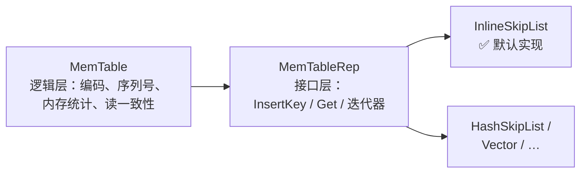
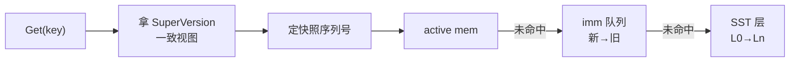

# 📘 数据通路（Data Path）：Put/Get 工作流与 InternalKey 编码

> RocksDB 源码精读 · 01 数据通路 | 源码版本 [`e6a2ee0`](https://github.com/facebook/rocksdb/tree/e6a2ee0bd211489e64a45a6a0f6ce1dc67e195d7) | 本篇涵盖：Put/Get 完整工作流、三层可插拔设计、WriteBatch 格式与回放链路、Entry 编码、InternalKey 排序规则、LookupKey
>
> 🧭 导读：本篇把 MemTable 的内存容器（跳表）当**黑盒**——只管数据怎么流进去、怎么查出来；跳表自身是什么、内部怎么工作，全在 [02-skiplist](02-skiplist.md)。

---

## 🧠 核心概念总览

- [*知识点1: Put 完整工作流（组提交）*](#id1)
- [*知识点2: 三层可插拔设计*](#id2)
- [*知识点3: 写批量(WriteBatch)的物理格式*](#id3)
- [*知识点4: WriteBatch → Node：逐条回放进跳表*](#id4)
- [*知识点5: Entry 编码与 varint32*](#id5)
- [*知识点6: PackSequenceAndType 位布局*](#id6)
- [*知识点7: InternalKeyComparator 排序规则*](#id7)
- [*知识点8: LookupKey 结构与栈上缓冲优化*](#id8)
- [*知识点9: Get 完整工作流（SuperVersion 三级查找）*](#id9)
- [*知识点10: MemTable::Get 内部细节*](#id10)

---

<a id="id1"></a>
## ✅ 知识点 1: Put 完整工作流（组提交）

**Put 不是一次函数调用...**

**一次 `Put` 的完整旅程（编号即顺序）**：

1. **打包**：`DBImpl::Put` 把操作装进 `WriteBatch`，进入 `WriteImpl`（[db_impl_write.cc:867](https://github.com/facebook/rocksdb/blob/e6a2ee0bd211489e64a45a6a0f6ce1dc67e195d7/db/db_impl/db_impl_write.cc#L867)）
    - 你调用 `db->Put(key, value)` 时，RocksDB 不会立刻写磁盘
    - 它先把你的 `key-value` 包进一个 `WriteBatch`（写批次）对象里
    - 然后进入内部的 `WriteImpl` 函数，这是写入路径的真正入口
2. **组队（组提交 Group Commit）**：`write_thread_.JoinBatchGroup(&w)`（[:1099](https://github.com/facebook/rocksdb/blob/e6a2ee0bd211489e64a45a6a0f6ce1dc67e195d7/db/db_impl/db_impl_write.cc#L1099)）——并发写线程在此汇合：**先到的当 leader，其余当 follower**
    - 多个线程同时调用 Put 时，它们都会跑到这里
    - 第一个到达的线程当 leader（队长），后面的线程当 follower（队员）
    - Follower 把它们的 `WriteBatch` 挂到 leader 的后面，然后阻塞等待
    > 类比：地铁闸机，第一个人刷卡后，后面几个人把票都给他，他统一刷卡，大家依次通过
3. **leader 预处理**：`PreprocessWrite`（[:1179](https://github.com/facebook/rocksdb/blob/e6a2ee0bd211489e64a45a6a0f6ce1dc67e195d7/db/db_impl/db_impl_write.cc#L1179)）——检查 MemTable 是否写满；若满则 `SwitchMemtable`（[:388](https://github.com/facebook/rocksdb/blob/e6a2ee0bd211489e64a45a6a0f6ce1dc67e195d7/db/db_impl/db_impl_write.cc#L388)）：当前 active 被 `MarkImmutable()` 打成只读、挂进 `imm_` 队列，另建一个新的 active
    - Leader 在真正写之前，先检查当前的 active MemTable（正在写的内存跳表）是否达到阈值
    - 如果满了：
        - 把当前的 active MemTable 标记为只读（`MarkImmutable()`）
        - 把它挂进 `imm_` 队列（`immutable memtable list`），等待后台线程 flush 到磁盘
        - 新建一个空的 active MemTable，供后续写入使用
4. **leader 写 WAL**：整组的 batch 合并后一次性 `WriteToWAL`（[:2262](https://github.com/facebook/rocksdb/blob/e6a2ee0bd211489e64a45a6a0f6ce1dc67e195d7/db/db_impl/db_impl_write.cc#L2262)）——**序列号在写 WAL 时统一分配**（[:1375](https://github.com/facebook/rocksdb/blob/e6a2ee0bd211489e64a45a6a0f6ce1dc67e195d7/db/db_impl/db_impl_write.cc#L1375) 注释）。**WAL 先落盘、MemTable 后更新，崩溃恢复依赖这个顺序**
    - Leader 把自己和所有 follower 的 `WriteBatch` 合并成一个大 batch
    - 然后调用 `WriteToWAL`，一次性把合并后的数据写到 WAL（预写日志）磁盘文件
    - 关键细节：
        - 序列号（sequence number）在此时统一分配，保证顺序
        - WAL 先落盘，MemTable 后更新——如果进程在 WAL 写完后、MemTable 更新前崩溃，恢复时可以通过重放 WAL 找回数据
5. **插 MemTable**：WAL 写完后，整组人（leader + followers）的 batch 数据需要插入到内存的 active MemTable（跳表）中，这里分了两种策略：
   - **非并发模式**：**Leader 一个人干**，leader 统一 replay 整组 batch
   - **并发模式（默认）**：**大家各自干**，leader 写完 WAL 放行，**follower 各自**调 `WriteBatchInternal::InsertInto`（[:1112-1117](https://github.com/facebook/rocksdb/blob/e6a2ee0bd211489e64a45a6a0f6ce1dc67e195d7/db/db_impl/db_impl_write.cc#L1112-L1117)），以 `concurrent_memtable_writes=true` **并发**插跳表——**这就是 InlineSkipList 必须做成无锁的根因**（详见 [02-skiplist](02-skiplist.md)）
6. **发布**：等全组人都把数据插进 MemTable 后 `versions_->SetLastSequence(last_sequence)`（[:1137](https://github.com/facebook/rocksdb/blob/e6a2ee0bd211489e64a45a6a0f6ce1dc67e195d7/db/db_impl/db_impl_write.cc#L1137)）——新序列号对读者可见，写入返回
    - RocksDB 用序列号（sequence number）实现 MVCC（多版本并发控制）。每个 key-value 在 `MemTable` 里都有一个 seq
    - 读线程读数据时，只读 `seq ≤ last_sequence` 的数据
    - 在 `SetLastSequence` 之前，虽然数据已经在 `MemTable` 里了，但读线程"看不到"——因为它们的 `seq` 大于当前的 `last_sequence`
    - 调用后，`last_sequence` 被推进到这组写入的最大 `seq`，**整组写入原子性对外可见**


**所以在全过程中起到关键作用的`memtable`到底是什么？**
- MemTable 在 RocksDB 里有两种身份：


    - **active**（`cfd->mem()`，[column_family.h:381](https://github.com/facebook/rocksdb/blob/e6a2ee0bd211489e64a45a6a0f6ce1dc67e195d7/db/column_family.h#L381)）：可读可写，**唯一**
    - **immutable 队列**（`cfd->imm()`，[:380](https://github.com/facebook/rocksdb/blob/e6a2ee0bd211489e64a45a6a0f6ce1dc67e195d7/db/column_family.h#L380)，类型 `MemTableList`）：**只读**，按新→旧排列，排队等后台 flush 成 SST

**"插入 MemTable"最终落到的就是跳表本身**：active MemTable 的容器正是 `InlineSkipList`：

- **插入链路的最后一跳**（第 5 步的代码特写，[skiplistrep.cc:46-48](https://github.com/facebook/rocksdb/blob/e6a2ee0bd211489e64a45a6a0f6ce1dc67e195d7/memtable/skiplistrep.cc#L46-L48)）：

    ```cpp
    bool InsertKey(KeyHandle handle) override {
    return skip_list_.Insert(static_cast<char*>(handle));
    }
    ```

    - `KeyHandle` 本质就是指向编码字节的裸指针 `char*`（内存由 **Arena 分配器**统一分配，见 [02-skiplist](02-skiplist.md)）
    - `static_cast` 零开销：设计契约是"调用方保证传进来的就是跳表分配的字节"

> 💡 **理解技巧**：组提交把 N 个线程的 WAL 写合并成 1 次，摊薄昂贵的磁盘 IO；插跳表走无锁，把 CPU 并行度拉满——**串行化昂贵的，并行化便宜的**。
> ⚠️ **关键区分**：WAL 落盘 ≠ 数据可读。序列号经 `SetLastSequence` 发布后，这版数据才对读者可见。


---

<a id="id2"></a>
## ✅ 知识点 2: 三层可插拔设计

它在 RocksDB 里被谁包着、怎么被调用：**MemTable 管逻辑，MemTableRep 定接口，InlineSkipList 干苦力。**



**各层职责：**

- **MemTable（逻辑层）**：编码、序列号、内存统计、读一致性；对外由 `ColumnFamilyData` 持有为 `mem()` / `imm()` 两兄弟（[column_family.h:380-381](https://github.com/facebook/rocksdb/blob/e6a2ee0bd211489e64a45a6a0f6ce1dc67e195d7/db/column_family.h#L380-L381)）
- **MemTableRep（接口层）**：`InsertKey` / `Get` / 迭代器的纯抽象类（`include/rocksdb/memtablerep.h`）
- **InlineSkipList（实现层）**：真正的跳表；备选还有 HashSkipList、Vector 等

**默认配置**（[advanced_options.h:754-755](https://github.com/facebook/rocksdb/blob/e6a2ee0bd211489e64a45a6a0f6ce1dc67e195d7/include/rocksdb/advanced_options.h#L754-L755)）：

1. **策略模式解决"用什么"**：MemTable 只依赖 `MemTableRep` 接口，底层是跳表、哈希跳表还是 Vector 对它完全透明。运行时换配置就能切策略，代码不用改。

2. **工厂模式解决"怎么造"**：创建跳表需要传比较器、分配器等一堆参数，MemTable 不想管这些脏活。工厂把创建逻辑包起来，MemTable 只管调用 `CreateMemTableRep()` 拿成品用。

```cpp
std::shared_ptr<MemTableRepFactory> memtable_factory =
    std::shared_ptr<SkipListFactory>(new SkipListFactory);
```


---

<a id="id3"></a>
## ✅ 知识点 3: 写批量(WriteBatch)的物理格式
**MemTable 拿到数据后的第一件事是编码，而编码的源头是写批量——WriteBatch 长什么样**

- WriteBatch 是 RocksDB 的**最小写入事务单元**——WAL 存的是它，MemTable 回放的还是它
    
    - **本质是一段二进制字节串**  
        不是逻辑对象，是 `12字节头 + N条记录` 的紧凑二进制格式，直接往 WAL 里写

    - **头部 12 字节：sequence + count**  
        前 8 字节存这批写入的起始序列号，后 4 字节存有几条记录，后面紧跟具体数据。

    - **每条记录(record) = 类型标签 + 内容**  
        Put 是 `类型 + key + value`，Delete 是 `类型 + key`，Merge 类似；key/value 前面带长度前缀。

    - **存在的三个意义**  
        **原子性**（一批要么全写要么全不写）、**摊薄成本**（一批只写一次 WAL、统一分配序列号）、**崩溃恢复整批 replay**。


- 源码里的格式注释（[write_batch.cc:10-37](https://github.com/facebook/rocksdb/blob/e6a2ee0bd211489e64a45a6a0f6ce1dc67e195d7/db/write_batch.cc#L10-L37)）：

    ```
    WriteBatch::rep_ :=
        sequence: fixed64     ← 这批写入的起始序列号
        count:    fixed32     ← 批里有几条记录
        data:     record[count]
    record := kTypeValue varstring varstring    ← Put: key + value
            | kTypeDeletion varstring           ← Delete: 只有 key
            | kTypeMerge  varstring varstring   ← Merge 操作
            | ...（还有列族变体、事务 XID 等十余种）
    varstring := len: varint32 + data: uint8[len]
    ```

    - **头部长度是常量 `kHeader = 12`**（[write_batch_internal.h:82](https://github.com/facebook/rocksdb/blob/e6a2ee0bd211489e64a45a6a0f6ce1dc67e195d7/db/write_batch_internal.h#L82)）：8 字节 sequence + 4 字节 count
    - **WriteBatch 是"集装箱"**：整体是一段二进制字节串，包含 12 字节头部 + 一堆 record
        - RocksDB 允许你先 batch.Put(k1, v1)、batch.Delete(k2)，再 db.Write(batch)，这样一批里就有多个 record
        - 多个线程同时写时，RocksDB 会把它们攒成一个 WriteBatch 一起刷 WAL，减少磁盘 IO 次数
    - **record 是"集装箱里的货"**：每条 record 是一次具体操作（Put / Delete / Merge），是 WriteBatch 的组成部分

    - **count 告诉你有几件货**：WriteBatch 头部里的 `count` 字段，说明后面紧跟了多少条 record

    - **解析时逐个拆箱**：先读 12 字节头拿到 `count`，然后循环 `count` 次，每次按类型解析一条 record

> **一句话关系**：**WriteBatch 装 record，record 是 WriteBatch 的最小操作单元**


---

<a id="id4"></a>
## ✅ 知识点 4: WriteBatch → Node：逐条回放进跳表

**新疑问：WAL 写完之后，这串字节怎么变成跳表里的一个个 Node？**

- **入口：`WriteBatchInternal::InsertInto`**（[:3274-3306](https://github.com/facebook/rocksdb/blob/e6a2ee0bd211489e64a45a6a0f6ce1dc67e195d7/db/write_batch.cc#L3274-L3306)，组提交 leader 统一回放路径；[:3308-3335](https://github.com/facebook/rocksdb/blob/e6a2ee0bd211489e64a45a6a0f6ce1dc67e195d7/db/write_batch.cc#L3308-L3335)，并发模式每人各跑一份）：

    ```cpp
    MemTableInserter inserter(sequence, memtables, ...);
    SetSequence(writer->batch, sequence);          // 把分到的起始 seq 写回 batch 头
    Status s = writer->batch->Iterate(&inserter);  // 启动逐条回放
    if (concurrent_memtable_writes) {
    inserter.PostProcess();                      // 并发模式的统计收尾
    }
    ```

- **三件事**：
    1. 造一个回放器（`MemTableInserter`）
    2. 把 leader 分到的起始序列号写回 batch 头部那个 fixed64 字段（正是知识点 3 格式里的 `sequence`）
    3. `MemTableIterater` 开拆

- **拆箱：`Iterate` 顺序扫字节串，逐条回调**（[:518-525](https://github.com/facebook/rocksdb/blob/e6a2ee0bd211489e64a45a6a0f6ce1dc67e195d7/db/write_batch.cc#L518-L525) → [:527](https://github.com/facebook/rocksdb/blob/e6a2ee0bd211489e64a45a6a0f6ce1dc67e195d7/db/write_batch.cc#L527) 起）：

    - `rep_` 字节串的格式只有 WriteBatch 自己懂
    - 所以遍历逻辑由它提供：每解析出一条 record（读 tag → 读 varstring key → 读 varstring value），就调用 handler 对应的方法（`PutCF` / `DeleteCF` / `MergeCF`……）
    - `inserter` 负责编码 + 插入回调里把 `user_key + seq + type + value` 编码成 `InternalKey`
    - 走 `MemTableRep::Allocate` 拿内存块，再 `Insert` 进跳表
- 💡 这是 **Visitor 模式**（访问者模式）：  
    - `WriteBatch` 只管"遍历拆箱"（遍历逻辑固定）
    - `inserter` 只管"怎么处理"（回放进 `MemTable`、打印调试、统计大小各挂各的 `handler`）
    - 回放场景挂的 handler 就是 `MemTableInserter`

**发号：`MemTableInserter` 每条 record 发一个序列号**（[:2025](https://github.com/facebook/rocksdb/blob/e6a2ee0bd211489e64a45a6a0f6ce1dc67e195d7/db/write_batch.cc#L2025)）：

- 它持有 `sequence_`，从 batch 的起始 seq 开始；默认 **seq_per_key**——每处理一条 record，`MaybeAdvanceSeq()` 里 `sequence_++`（[:2208-2212](https://github.com/facebook/rocksdb/blob/e6a2ee0bd211489e64a45a6a0f6ce1dc67e195d7/db/write_batch.cc#L2208-L2212)）
- 这就是知识点 1 第 4 步"写 WAL 时统一分配序列号"的**落点**：WAL 里只存 batch 的起始 seq，逐条的 seq 在回放时现场递增发出——batch 内第 i 条 record 拿到 `起始seq + i`
- 回调核心（以 Put 为例，`PutCFImpl` [:2285](https://github.com/facebook/rocksdb/blob/e6a2ee0bd211489e64a45a6a0f6ce1dc67e195d7/db/write_batch.cc#L2285)）：取出当前列族（Column Family，可理解为逻辑分库）的 MemTable（[:2315](https://github.com/facebook/rocksdb/blob/e6a2ee0bd211489e64a45a6a0f6ce1dc67e195d7/db/write_batch.cc#L2315)），调 `mem->Add(sequence_, kTypeValue, key, value, ...)`（[:2322](https://github.com/facebook/rocksdb/blob/e6a2ee0bd211489e64a45a6a0f6ce1dc67e195d7/db/write_batch.cc#L2322)）

**落地：`MemTable::Add` 四步**（[memtable.cc:1116-1219](https://github.com/facebook/rocksdb/blob/e6a2ee0bd211489e64a45a6a0f6ce1dc67e195d7/db/memtable.cc#L1116-L1219)）：

```cpp
// ① 算长度：varint(key_size) + key + 8B packed + varint(value_size) + value
const uint32_t encoded_len = VarintLength(internal_key_size) + ...;
KeyHandle handle = table->Allocate(encoded_len, &buf);   // ② 拿地
char* p = EncodeVarint32(buf, internal_key_size);        // ③ 编码写入 buf
...
// ④ 挂链：非并发 InsertKey / 并发 InsertKeyConcurrently
```

- **② 拿地**：`SkipListRep::Allocate`（[skiplistrep.cc:35-38](https://github.com/facebook/rocksdb/blob/e6a2ee0bd211489e64a45a6a0f6ce1dc67e195d7/memtable/skiplistrep.cc#L35-L38)）就一行：`*buf = skip_list_.AllocateKey(len)` → `AllocateNode(len, RandomHeight())`——**02 知识点 2 的三段式 Node 在这里从 Arena 切出**，身高已随机、已 StashHeight 存好，返回的 `buf` 正是 key 区起点
- **③ 编码**：往 buf 里按格式写字节——逐字段细节就是下一个知识点
- **④ 挂链分流**：`concurrent_memtable_writes` 决定走 `InsertKey`（[:1180](https://github.com/facebook/rocksdb/blob/e6a2ee0bd211489e64a45a6a0f6ce1dc67e195d7/db/memtable.cc#L1180) → `skip_list_.Insert`）还是 `InsertKeyConcurrently`（[:1211](https://github.com/facebook/rocksdb/blob/e6a2ee0bd211489e64a45a6a0f6ce1dc67e195d7/db/memtable.cc#L1211) → `skip_list_.InsertConcurrently`）——**02 知识点 7 的"非并发 SetNext"与"CAS 链接"两条路径在这里分道**，也正是知识点 1 第 5 步"两种策略"的落地


> 📋 **术语提醒**：`sequence_` 是回放器手里的"发号机读数"，随每条 record 递增；batch 头里那个 fixed64 只是起始值。
> ⚠️ **关键区分**：WAL 里的 seq 是**批次起始值**；跳表里每条 entry 的 seq 是**回放时逐条递增**发出的。崩溃恢复重放 WAL 时走同一套 InsertInto 逻辑，seq 严格重现。
> 💡 **理解技巧**：这条链上每一环都是别的知识点埋的钩子——知识点 3 的字节串格式、知识点 5 的编码、02 的 AllocateNode 与 CAS 链接。看懂这一节，01 和 02 就焊死了。


---

<a id="id5"></a>
## ✅ 知识点 5: Entry 编码与 varint32

**batch replay 之后，每条记录进 MemTable 时怎么编码**

- **MemTable 里存的不是原始 key，是一段"打包好的字节串"：长度前缀 + key + 8 字节版本标签 + 长度前缀 + value**
    - **8 字节 `packed` 是"身份证"**: 把序列号（`seq`）和操作类型（`Put/Delete`）打包成 8 字节塞在 `key` 和 `value` 中间，用来区分同 一 `key` 的不同版本

- `MemTable::Add` 的编码（格式注释 [memtable.cc:1122-1127](https://github.com/facebook/rocksdb/blob/e6a2ee0bd211489e64a45a6a0f6ce1dc67e195d7/db/memtable.cc#L1122-L1127)，实现 [:1142-1152](https://github.com/facebook/rocksdb/blob/e6a2ee0bd211489e64a45a6a0f6ce1dc67e195d7/db/memtable.cc#L1142-L1152)）：

    ```cpp
    // Format of an entry is concatenation of:
    //  key_size     : varint32 of internal_key.size()
    //  key bytes    : char[internal_key.size()]
    //  value_size   : varint32 of value.size()
    //  value bytes  : char[value.size()]
    // 把 internal_key_size 这个整数，用 VarInt 的方式写进内存
    char* p = EncodeVarint32(buf, internal_key_size);
    // 把真正的 key 内容复制到刚才那个位置后面
    memcpy(p, key.data(), key_size);
    ...
    // seq + type 打包成 uint64_t 版本信息
    uint64_t packed = PackSequenceAndType(s, type);
    // 将版本信息固定写入 8 bytes
    EncodeFixed64(p, packed);
    ```

    ```
    | varint32 key_size | key bytes | 8B packed(seq+type) | varint32 val_size | value bytes | [checksum] |
    ```

- **为什么用 varint32 存长度？省空间**

    - RocksDB 怎么知道 key/val 有多长，需要一个 `key_size`，`value_size` 告知
    - **VarInt32 用小数值少占字节，绝大多数 key/value 长度很短，百万条记录能省 MB 级内存。**
        - `varint32`： value或key长度 ≤127 时只占 **1 字节**
        - `fixed32` 恒占 **4 字节**
    - 同一套 varint 编码也用在 LevelDB / Protocol Buffers 里
- **`internal key` 又是什么？** 
    - RocksDB 有 `User Key` 比如 `"name"`
    - `Internal Key` =  `User Key ` + ` 8-byte packed`
    - 存储是真正使用的 'key'

> ⚠️ **关键区分**：跳表存的 key **不是**原始用户 key，而是这段编码字节串（含 seq + type）。
> 📋 **术语提醒**：`varint(可变长整数)`——小数值少占字节，以 CPU 换空间，是存储系统的常规武器。

---

<a id="id6"></a>
## ✅ 知识点 6: PackSequenceAndType 位布局

**编码里那 8 字节 `packed` 到底装了什么？**

- **序列号和记录类型被压进 8 字节：高 56 位是序列号，低 8 位是类型**[dbformat.h:181-186](https://github.com/facebook/rocksdb/blob/e6a2ee0bd211489e64a45a6a0f6ce1dc67e195d7/db/dbformat.h#L181-L186)：

    ```cpp
    // 左移 8 位给 type 腾座位，或运算把它塞进去；
    // 拆的时候右移还原 seq，掩码抠出 type
    inline uint64_t PackSequenceAndType(uint64_t seq, ValueType t) {
    assert(seq <= kMaxSequenceNumber);
    assert(IsExtendedValueType(t) || t == kTypeMaxValid);
    return (seq << 8) | t;
    }
    ```

    - 解包对称（[dbformat.h:190-194](https://github.com/facebook/rocksdb/blob/e6a2ee0bd211489e64a45a6a0f6ce1dc67e195d7/db/dbformat.h#L190-L194)）：
        1. `seq = packed >> 8`：整体右移 8 位，扔掉 `type`，还原 `seq`
        2. `type = packed & 0xff`：`0xFF` 是 `11111111`，只保留低 8 位，抠出 `type`
    - **位布局决定排序**：packed 值大 ⇔ seq 大（type 只在 seq 相同时起决胜作用）——知识点 7 的排序规则建立在这上面
    - `ValueType` 常见值：`kTypeValue`（正常值）、`kTypeDeletion`（点删除墓碑）、`kTypeMerge`（合并操作）

> ⚠️ **关键区分**：这 8 字节**跟在 user key 后面**，构成**内部键**(InternalKey)的尾部——跳表排序看的是整个 InternalKey，不是裸 user key

---


<a id="id7"></a>
## ✅ 知识点 7: InternalKeyComparator 排序规则

**packed 的位布局直接决定了跳表的排序规则**

- **排序三关键字：先 `user key` 升序 → 再 `seq` 降序 → 然后 `type` 降序，`seq` 降序是让"查找恰好落在可见版本上"的关键** 源码注释原文（[dbformat.cc:201-204](https://github.com/facebook/rocksdb/blob/e6a2ee0bd211489e64a45a6a0f6ce1dc67e195d7/db/dbformat.cc#L201-L204)）：

    ```cpp
    // Order by:
    //    increasing user key (according to user-supplied comparator)
    //    decreasing sequence number
    //    decreasing type (though sequence# should be enough to disambiguate)
    ```

- **多版本在跳表里的物理布局**（以 user key `"name"` 写过三次为例）：

    ```
    跳表中的排列（comparator 序）：
    [name|seq=7] -> [name|seq=5] -> [name|seq=3] -> [下一个 user key] -> ...
    ^
    最新版本永远排在同 key 的最前面

    查找 name @ 快照 seq=6：
    LookupKey = (name, 6, kValueTypeForSeek)
    按排序规则，它"假想"的位置卡在 seq=7 和 seq=5 之间
    Seek → 第一个 ≥ LookupKey 的条目 = [name|seq=5] ✔ 恰好是可见的最新版本
    ```
    - **查找时"卡位"直接命中**：
        1. 快照 `seq=6` 想读 `"name"`，RocksDB 构造一个假想的 `(name, 6)` 去跳表 `Seek`
        2. 因为 `seq` 降序，这个位置刚好卡在 `7` 和 `5` 之间，`Seek` 返回的第一个有效记录就是 `[name|5]`
        3. 即对 `seq=6` 可见的最新版本, 快照 `seq=6` 的规则是"只认 `≤6` 的版本"


> 💡 **理解技巧**：seq 降序的精妙之处——**一次 Seek 直接命中可见版本**，不用先找到最新再往回退。
> 🔄 **知识关联**：`kValueTypeForSeek = kTypeValuePreferredSeqno`（[dbformat.cc:28](https://github.com/facebook/rocksdb/blob/e6a2ee0bd211489e64a45a6a0f6ce1dc67e195d7/db/dbformat.cc#L28)），与 preferred seqno 读优化有关，细节这里不展开。


---

<a id="id8"></a>
## ✅ 知识点 8: LookupKey 结构与栈上缓冲优化

**排序规则定了，查找时拿什么当"探针"去 Seek?**

- RocksDB 查找一个 `key` 时，需要构造一个临时的 `InternalKey`，然后拿它去 `Seek()` 找位置，跳表不认识裸 key
    - RocksDB 只认 `InternalKey` 格式的字节串；`LookupKey` 就是临时伪造一张"同格式工牌"混进去找人的。
    - **`LookupKey`格式**：`userkey` 长度 + `userkey` 内容 + 8 字节(`seq`+`type`)

- **`LookupKey` 布局**（[lookup_key.h:47-57](https://github.com/facebook/rocksdb/blob/e6a2ee0bd211489e64a45a6a0f6ce1dc67e195d7/db/lookup_key.h#L47-L57)）：

    ```
    | varint32 klength | userkey bytes | 8B tag = Pack(seq, kValueTypeForSeek) |
    ^                     ^                                                       ^
    start_               kstart_                                               end_
    ```

    - **构造实现**：[dbformat.cc:245-266](https://github.com/facebook/rocksdb/blob/e6a2ee0bd211489e64a45a6a0f6ce1dc67e195d7/db/dbformat.cc#L245-L266)
    - **工程细节**：这个临时 `InternalKey` 本来可以用 `malloc` 动态申请内存，但 `RocksDB` 发现 key 通常很短、而且这个操作非常频繁
    - 所以它直接在栈上准备一个 `char space_[200]`，相当于准备了一个临时小盒子，大多数 key 直接放进去，直接塞栈里，不用 malloc，用完自动释放
        - `start_` 指向整段开头（含长度前缀）→ `memtable_key()` 用
        - `kstart_` 指向 `userkey` 开头 → `internal_key()` 用
        - `end_` 指向末尾，同一段内存两个视图，零拷贝
    - `memtable_key()` 返回从 `start_` 起的整段；`internal_key()` 返回从 `kstart_` 起的后缀——**同一段内存，两个视图**

> 💡 **理解技巧**：栈上小缓冲区（SSO 思想/Small String/Buffer optimization）是高频小对象的标准优化——Get 是热路径，省一次 malloc 就是省一次潜在的缓存未命中。

---
<a id="id9"></a>
## ✅ 知识点 9: Get 完整工作流（SuperVersion 三级查找）


一次 `Get` 的完整旅程就是先 **拿一张"一致视图"（SuperVersion），再按 新→旧 三级查找**（注意：实现由协程宏生成，真身在 [db_impl_sync_and_async.h](https://github.com/facebook/rocksdb/blob/e6a2ee0bd211489e64a45a6a0f6ce1dc67e195d7/db/db_impl/db_impl_sync_and_async.h)）：

1. **从`GetImpl`开始取视图**：`GetAndRefSuperVersion(cfd)`（[:126](https://github.com/facebook/rocksdb/blob/e6a2ee0bd211489e64a45a6a0f6ce1dc67e195d7/db/db_impl/db_impl_sync_and_async.h#L126)）固定住当前状态
    - `SuperVersion` "快照取景框" = 当前 `active mem` + `imm` 队列 + 当前 `Version（SST 集合）`的**一致快照**（结构定义 [column_family.h:208-214](https://github.com/facebook/rocksdb/blob/e6a2ee0bd211489e64a45a6a0f6ce1dc67e195d7/db/column_family.h#L208-L214)）
2. **定快照序列号** `snapshot_seq`：
    - 有用户指定的快照用指定快照；
    - 否则 `GetLastPublishedSequence()`（[:141-156](https://github.com/facebook/rocksdb/blob/e6a2ee0bd211489e64a45a6a0f6ce1dc67e195d7/db/db_impl/db_impl_sync_and_async.h#L141-L156)）
    - 源码注释点出一个微妙的并发正确性细节（[:151-155](https://github.com/facebook/rocksdb/blob/e6a2ee0bd211489e64a45a6a0f6ce1dc67e195d7/db/db_impl/db_impl_sync_and_async.h#L151-L155)）：**必须先引用 SuperVersion 再取序列号**
    - 否则两步之间发生 flush，可能把快照本应看到的数据 compact 掉
3. **拼探针**：`LookupKey lkey(key, snapshot, ...)`（[:201](https://github.com/facebook/rocksdb/blob/e6a2ee0bd211489e64a45a6a0f6ce1dc67e195d7/db/db_impl/db_impl_sync_and_async.h#L201)）
    - 用 `(user_key, snapshot_seq)` 拼一个假 `InternalKey`，格式和跳表里的一模一样，这样才能进 `MemTable` 做二分查找
4. **三级查找，新→旧**：
   - `sv->mem->Get(...)`：active MemTable（[:233](https://github.com/facebook/rocksdb/blob/e6a2ee0bd211489e64a45a6a0f6ce1dc67e195d7/db/db_impl/db_impl_sync_and_async.h#L233)）（刚写的，最热）
   - 未命中 → `sv->imm->Get(...)`——immutable 队列（[:251](https://github.com/facebook/rocksdb/blob/e6a2ee0bd211489e64a45a6a0f6ce1dc67e195d7/db/db_impl/db_impl_sync_and_async.h#L251)）（已冻结待 flush 的）
   - 再未命中 → `sv->current->Get(...)`——SST 层（[:296](https://github.com/facebook/rocksdb/blob/e6a2ee0bd211489e64a45a6a0f6ce1dc67e195d7/db/db_impl/db_impl_sync_and_async.h#L296)）（落盘数据）
   - 找到即返回，越新的数据查得越快
5. **每层内部**：`MemTable::Get` 的细节见知识点 10



假设 key 是 `"name"`，时间线如下：

- `seq=1`：Put `"Alice"` → 被 flush 到 **SST**
- `seq=3`：Put `"Bob"` → 被 flush 到 **SST**  
- `seq=5`：Put `"Charlie"` → 在 **active mem**
- `seq=7`：Delete → 在 **active mem**


- **例 1：无快照 Get（最新视图，snapshot=7）**
    1. **取 SuperVersion**：固定住当前三件套（active mem 有 5、7 / SST 有 1、3）
    2. **定快照号**：拿到最新 published seq = **7**
    3. **拼探针**：`LookupKey("name", 7)`
    4. **查 active mem**：Seek 直接命中 `[name|seq=7|Delete]` → 发现是删除标记，**立刻返回 NotFound**
    5. **SST 根本不用碰** —— 最新的已经告诉你这 key 没了

- **例 2：快照 Get（snapshot=6，想读"那一刻"的数据）**

    1. **SuperVersion 同上**，但快照号固定为 **6**
    2. **拼探针**：`LookupKey("name", 6)`
    3. **查 active mem**：`[name|7]` 的 seq=7 > 6，对快照 6 来说"还没出生"，跳过；下一条 `[name|5]` 的 seq=5 ≤ 6，**命中，返回 "Charlie"**
    4. **不用查 SST** —— active mem 里已经有可见的最新版本
    5. **关键点**：seq 降序让 Seek 自动"穿过"不可见的新版本，直接落在可见版本上


> 💡 **理解技巧**：SuperVersion 是 MVCC 的"取景框"——读全程不加 DB 级大锁，靠引用计数固定住这一刻的 mem/imm/Version 三件套。
> 🔄 **知识关联**：第 4 步解释了为什么"刚写进的立刻能读到"——active 永远最先查；"刷盘后还能读到旧数据"靠的是 SST 层的版本接力

---


<a id="id10"></a>
## ✅ 知识点 10: MemTable::Get 内部细节

**三级查找里每一级的 `MemTable::Get` 内部又做了什么？**

- **进跳表之前先问 Bloom；命中之后逐版本判可见性；读到墓碑立即短路**
    - bloom filter 实现： 一个 bit 数组 + 多个哈希函数。插入时把元素用几个哈希函数映射到数组位置，全置为 1；查询时看这些位是否都为 1
    - 如果都为1 表示可能有，否则一定没有

- `MemTable::Get` 的流程（[memtable.cc:1568-1647](https://github.com/facebook/rocksdb/blob/e6a2ee0bd211489e64a45a6a0f6ce1dc67e195d7/db/memtable.cc#L1568-L1647)）：
    1. **空表直接走人**  
   先 `IsEmpty()`，MemTable 里啥都没有就直接返回 NotFound，不浪费时间。

   2. **范围删除检查**：`MaxCoveringTombstoneSeqnum`（range tombstone 走独立结构，不占点查询路径）：检查 `range tombstome` 是否覆盖了正在查找的`key`

    3. **Bloom Filter 挡第一关**  
   MemTable 自己也有 Bloom Filter `bloom_filter_`（不是 SST 专属）。问一遍：如果说"肯定不存在"，直接返回，**跳表都不用进**，省一次 O(log n) 的 Seek。

    4. **进跳表 Seek，逐版本回调**  
    `GetFromTable`（[:1649](https://github.com/facebook/rocksdb/blob/e6a2ee0bd211489e64a45a6a0f6ce1dc67e195d7/db/memtable.cc#L1649)）→ 用 LookupKey Seek 命中后，从最新版本往回扫，每条记录回调 `SaveValue`：检查 seq ≤ 快照号（可见？）、检查类型（值/删除/合并）
        - 跳表按 `user_key `+` seq` 排序，`Seek` 用 `LookupKey` 卡位后，落点可能是 `seq` 比你大的新版本（对快照不可见），所以落点附近可能有多条同名记录

    5. **墓碑短路：读到删除标记立刻停**  
    如果碰到 `kTypeDeletion`（墓碑），说明这 key 被删了，**立刻返回 NotFound**，不用继续往下翻旧版本。
        - 墓碑是同一个 `key` 在 `MemTable` 里的最新可见状态，旧版本已被它物理覆盖，往下翻不可能翻出活口

    6. **Merge 特殊处理**  
   如果读到的是 Merge 操作，不直接返回值，而是标记 `MergeInProgress`，留给上层把多个 Merge 记录合并成最终结果。


**一句话记忆**：先问 Bloom 省 CPU，再进跳表逐版本判，墓碑直接短路，Merge 留给上层。


> ⚠️ **关键区分**：MemTable 也有自己的 Bloom Filter——不是 SST 专利，省的是进跳表 Seek 的 CPU。
> 📋 **术语提醒**：`tombstone(墓碑)` = 删除操作写入的特殊记录，读时判死、Compaction 时才真正清理。

---

## 📌 面试速记版

| 面试题 | 一句话答 |
|---|---|
| 一次 Put 经历什么？ | WriteBatch 打包 → JoinBatchGroup 组提交（leader 预处理 + 统一写 WAL 分配 seq）→ 全组并发 InsertInto 跳表 → SetLastSequence 发布可见 |
| 为什么先写 WAL 再写 MemTable？ | 崩溃恢复靠重放 WAL；WAL 先落盘，MemTable 丢了也能找回 |
| MemTable 的两种身份？ | active 唯一可读可写；imm_ 只读队列按新→旧排队等 flush |
| 三层可插拔设计？ | MemTable 管逻辑 / MemTableRep 定接口 / InlineSkipList 干苦力——策略 + 工厂，容器可换 |
| WriteBatch 物理格式？ | 12 字节头（fixed64 sequence + fixed32 count）+ record[count]；record = 类型标签 + varstring key/value |
| WriteBatch 怎么进跳表？ | InsertInto 用 MemTableInserter 逐条回放：每条 record 的 seq 递增发放 → MemTable::Add（AllocateKey 切 Node → 编码 → InsertKey 链接） |
| MemTable 一条 entry 的编码？ | varint32 key_size + key bytes + 8B packed(seq<<8 \| type) + varint32 value_size + value bytes |
| InternalKey 排序规则？ | user key 升序 → seq 降序 → type 降序；seq 降序让 LookupKey 一次 Seek 命中快照可见版本 |
| LookupKey 的优化？ | 栈上 space_[200] 小缓冲，短 key 零 malloc；start_/kstart_/end_ 同一段内存两个视图 |
| 一次 Get 经历什么？ | 拿 SuperVersion 一致视图 → 定快照 seq → 拼 LookupKey → active → imm → SST 三级查找（新→旧） |
| SuperVersion 是什么？ | active + imm + Version 的一致快照，引用计数固定，读路径不加 DB 大锁；必须先引用再取 seq（防 flush 间隙） |
| MemTable::Get 内部流程？ | 空表短路 → 范围删除检查 → Bloom 挡第一关 → 跳表 Seek → SaveValue 逐版本判可见性 → 墓碑短路、Merge 留上层 |

**记忆口诀**：**"Put 组队 WAL 先行，seq 发布才算成；user 升序 seq 降序，Seek 一步见版本；Get 拿框三级找，新到旧、墓碑停。"**

---

**下一站**：本篇把跳表当黑盒用——只管把编码好的字节串 `Insert` 进去、`Seek` 出来。这个黑盒内部长什么样？一个节点在内存里怎么摆、几十万节点的内存从哪来、多线程并发插凭什么不加锁？→ [02-skiplist](02-skiplist.md)

