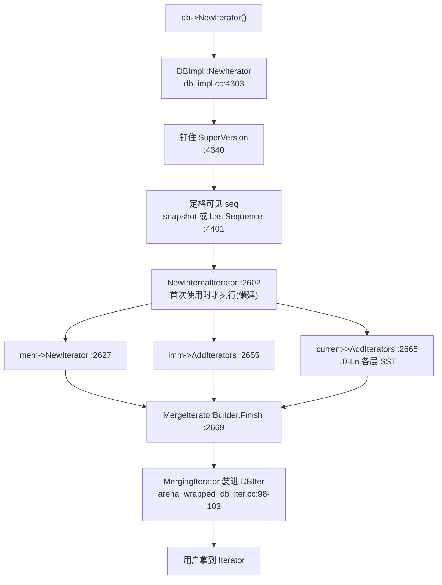

# 📘 Iterator：层层包装与可见性过滤（Iterator Stack & Visibility Filtering）

> RocksDB 源码精读 · 03 迭代器 | 源码版本 [`e6a2ee0`](https://github.com/facebook/rocksdb/tree/e6a2ee0bd211489e64a45a6a0f6ce1dc67e195d7) | 本篇涵盖：两层迭代器接口、MemTableIterator、NewIterator 创建链、MergingIterator 归并、DBIter 可见性过滤

**从 02 走来**：[02-skiplist](02-skiplist.md) 收尾时的 `InlineSkipList::Iterator`（[02 §KP9](02-skiplist.md#id9)）只是个**裸光标**：

- 它会 Seek/Next/Prev，但 `key()` 吐出的是 internal key 编码字节流——不认 user key，不懂删除标记（tombstone，墓碑），也不管多版本
- 而用户代码里 `db->NewIterator()` 拿到的 Iterator 却能直接看 user key/value、自动跳过被删与被覆盖的旧版本

从裸光标到用户 Iterator 之间的距离，RocksDB 用**层层包装**填平。本篇自下而上回答五问：

1. 内部接口和用户接口为什么分两层？（知识点 1）
2. memtable 侧的第一层包装加了什么？（知识点 2）
3. `db->NewIterator()` 一次调用到底造出了什么？（知识点 3）
4. 多个来源的有序流怎么归并成一条？（知识点 4）
5. 墓碑、旧版本、"快照之后写入的数据"是谁过滤掉的？（知识点 5）

---

## 🧠 核心概念总览

包装层次（自底向上，每层只干自己那件事）：

```
user code
  |  db->NewIterator()
  v
Iterator                 public API (user key/value)   include/rocksdb/iterator.h
  ^  wraps
DBIter                   visibility filter, tombstone  db/db_iter.cc
  ^  wraps
MergingIterator          k-way merge heap              table/merging_iterator.cc
  ^  one child per sorted run
MemTableIterator         prefix bloom, varint decode   db/memtable.cc
  ^  wraps
SkipListRep::Iterator    varint32 encode               memtable/skiplistrep.cc
  ^  wraps
InlineSkipList::Iterator raw cursor: Seek/Next/Prev    memtable/inlineskiplist.h  <-- 02 KP9
```

> 💡 数据流向与包装方向相反：写入时 user key 一路被**编码**成 internal key 沉到底（01 §KP4）；读取时裸字节流一路被**解码、归并、过滤**浮到顶。

- [*知识点1: 两层迭代器接口——InternalIterator 与 Iterator*](#id1)
- [*知识点2: MemTableIterator——memtable 的第一层包装*](#id2)
- [*知识点3: 创建链——db->NewIterator() 造出了什么*](#id3)
- [*知识点4: MergingIterator——N 路归并与方向切换的代价*](#id4)
- [*知识点5: DBIter——可见性过滤的最后一公里*](#id5)

---

<a id="id1"></a>
## ✅ 知识点 1: 两层迭代器接口——InternalIterator 与 Iterator

**RocksDB 的迭代器分内外两层：`InternalIterator` 在引擎内部搬运 internal key 字节流，`Iterator` 面向用户只露 user key/value。分层的意义：每个组件只懂一件事，套娃任意组合。**

[01 §KP5](01-data-path.md#id5) 讲过：引擎里有序存储的全部是 internal key = user key + 8 字节尾巴（seq 与类型）。01 的点查（Get）是"编好 LookupKey 一次性找"；而扫描要把字节流逐条递出去——递出去的每一步是什么形态，就是接口要回答的问题。

**内层：`InternalIterator`**。它是所有数据源（memtable、SST 文件、归并器）共同实现的抽象，定义在 [internal_iterator.h:24-215](https://github.com/facebook/rocksdb/blob/e6a2ee0bd211489e64a45a6a0f6ce1dc67e195d7/table/internal_iterator.h#L24-L215)——e6a2ee0 里它是个模板 `InternalIteratorBase<Slice>`，`InternalIterator` 是别名（[:217](https://github.com/facebook/rocksdb/blob/e6a2ee0bd211489e64a45a6a0f6ce1dc67e195d7/table/internal_iterator.h#L217)）。接口方法与用户侧一一对应：`Valid / Seek / SeekToFirst / SeekToLast / SeekForPrev / Next / Prev / key / value / status`。

两层的边界在哪？看 `user_key()` 的默认实现（[internal_iterator.h:115-117](https://github.com/facebook/rocksdb/blob/e6a2ee0bd211489e64a45a6a0f6ce1dc67e195d7/table/internal_iterator.h#L115-L117)）：

```cpp
// Return user key for the current entry.
virtual Slice user_key() const { return ExtractUserKey(key()); }
```

`key()` 返回带 8 字节尾巴的 internal key；`user_key()` 现场把尾巴剥掉（`ExtractUserKey` 即 01 §KP5 编码的逆运算）。**谁实现 InternalIterator，谁就可以假装不懂 user key。**

**外层：`IteratorBase` / `Iterator`**。用户 API 分两个头文件：`IteratorBase`（[iterator_base.h:14-109](https://github.com/facebook/rocksdb/blob/e6a2ee0bd211489e64a45a6a0f6ce1dc67e195d7/include/rocksdb/iterator_base.h#L14-L109)）承载全部移动与定位方法，`Iterator`（[iterator.h:29-113](https://github.com/facebook/rocksdb/blob/e6a2ee0bd211489e64a45a6a0f6ce1dc67e195d7/include/rocksdb/iterator.h#L29-L113)）继承它并加上 `value()`。方法集与内层镜像，但 `key()` 的语义变成 **user key**——剥尾巴、跳墓碑、压版本的活儿由最外层的 DBIter 干完（知识点 5），用户看到的已经是"干净"的数据。

**生命周期契约**（两层相同）：`key()`/`value()` 返回的 `Slice` 只是指向内部 buffer 的视图，**下一次移动迭代器就失效**（[iterator_base.h:98-102](https://github.com/facebook/rocksdb/blob/e6a2ee0bd211489e64a45a6a0f6ce1dc67e195d7/include/rocksdb/iterator_base.h#L98-L102)、[iterator.h:38-44](https://github.com/facebook/rocksdb/blob/e6a2ee0bd211489e64a45a6a0f6ce1dc67e195d7/include/rocksdb/iterator.h#L38-L44)）：

```cpp
// Return the key for the current entry.  The underlying storage for
// the returned slice is valid only until the next modification of the
// the iterator (i.e. the next SeekToFirst/SeekToLast/Seek/SeekForPrev/Next/Prev
// operation).
```

想让 Slice 活得和迭代器一样久？查两个属性：`rocksdb.iterator.is-key-pinned` / `rocksdb.iterator.is-value-pinned`（[iterator.h:59-71](https://github.com/facebook/rocksdb/blob/e6a2ee0bd211489e64a45a6a0f6ce1dc67e195d7/include/rocksdb/iterator.h#L59-L71)）——返回 "1" 表示底层保证钉住不动。memtable 就是恒钉住的例子（知识点 2）。

> 📋 **术语提醒**：`Slice` = RocksDB 的零拷贝字符串视图（`const char* data_ + size_t size_`，不拥有内存）；`pinned（钉住）` = 底层保证这块内存在迭代器存活期内不释放、不移动。
> 📋 **术语提醒**：两个接口都继承 `Cleanable`——一个可注册清理回调的基类，析构时依次执行回调。知识点 3 把 SuperVersion 的保活挂到迭代器上，靠的就是它。
> ⚠️ **关键区分**：`InternalIterator::Seek(target)` 的 target 是**连尾巴的 internal key**，不是 user key——由调用方（上层）负责编好。谁编的、怎么编，知识点 2 与 01 §KP8 对照着看。

→ **下一站**：接口定了。看第一个实现者怎么把 02 的裸光标包成一个 InternalIterator——知识点 2。

---

<a id="id2"></a>
## ✅ 知识点 2: MemTableIterator——memtable 的第一层包装

**MemTableIterator 包的不是跳表裸迭代器，而是 `MemTableRep::Iterator`；它在裸光标上补三件 memtable 级的能力：prefix bloom 提前止损、varint32 长度前缀解码、Seek 的编码分工。**

[01 §KP4](01-data-path.md#id4) 讲过数据进跳表时的节点格式：`[varint32 key 长度][internal key][varint32 value 长度][value]`。读出来就得按同一格式解——02 §KP9 的裸迭代器只会返回整段 buffer 起点，解格式是包装层的事。

**包装关系**。`MemTableIterator : public InternalIterator`（[memtable.cc:493-740](https://github.com/facebook/rocksdb/blob/e6a2ee0bd211489e64a45a6a0f6ce1dc67e195d7/db/memtable.cc#L493-L740)），成员是抽象的 `MemTableRep::Iterator* iter_`（[:716](https://github.com/facebook/rocksdb/blob/e6a2ee0bd211489e64a45a6a0f6ce1dc67e195d7/db/memtable.cc#L716)）。构造函数三分支（[:519-535](https://github.com/facebook/rocksdb/blob/e6a2ee0bd211489e64a45a6a0f6ce1dc67e195d7/db/memtable.cc#L519-L535)）：区间墓碑表走 `range_del_table_->GetIterator`；配了前缀提取器且 ReadOptions 允许时走 `GetDynamicPrefixIterator`；默认走 `table_->GetIterator`。对默认跳表 rep，拿到的是 `SkipListRep::Iterator`（[skiplistrep.cc:192](https://github.com/facebook/rocksdb/blob/e6a2ee0bd211489e64a45a6a0f6ce1dc67e195d7/memtable/skiplistrep.cc#L192)）——它里面才包着 02 §KP9 的 `InlineSkipList::Iterator`（[inlineskiplist.h:170-227](https://github.com/facebook/rocksdb/blob/e6a2ee0bd211489e64a45a6a0f6ce1dc67e195d7/memtable/inlineskiplist.h#L170-L227)）。

**Seek 的编码分工**（与 01 §KP8 对照着看）。点查 Get 是调用方编好 LookupKey 直接进跳表；迭代器 Seek 收到的 `k` 已经是上层编好的 internal key，MemTableIterator **原样透传**（[:592](https://github.com/facebook/rocksdb/blob/e6a2ee0bd211489e64a45a6a0f6ce1dc67e195d7/db/memtable.cc#L592) `iter_->Seek(k, nullptr)`），到 rep 层才由 `EncodeKey` 补上 varint32 长度前缀（[skiplistrep.cc:228-234](https://github.com/facebook/rocksdb/blob/e6a2ee0bd211489e64a45a6a0f6ce1dc67e195d7/memtable/skiplistrep.cc#L228-L234)，EncodeKey 本体 [memtable.cc:486-491](https://github.com/facebook/rocksdb/blob/e6a2ee0bd211489e64a45a6a0f6ce1dc67e195d7/db/memtable.cc#L486-L491)）：

```cpp
const char* EncodeKey(std::string* scratch, const Slice& target) {
  scratch->clear();
  PutVarint32(scratch, static_cast<uint32_t>(target.size()));
  scratch->append(target.data(), target.size());
  return scratch->data();
}
```

> 💡 **理解技巧**：点查与迭代器殊途同归——LookupKey 一步到位编出"长度前缀 + internal key"，迭代器把同一动作拆给两层（上层编 internal key、rep 层补长度前缀）。能殊途同归的原因：**跳表节点里躺着的格式只有一个**（01 §KP4）。

**prefix bloom 提前止损**（[:573-586](https://github.com/facebook/rocksdb/blob/e6a2ee0bd211489e64a45a6a0f6ce1dc67e195d7/db/memtable.cc#L573-L586)）。构造时若满足三开关（[:521-527](https://github.com/facebook/rocksdb/blob/e6a2ee0bd211489e64a45a6a0f6ce1dc67e195d7/db/memtable.cc#L521-L527)：`prefix_same_as_start`，或 `!total_order_seek && !auto_prefix_mode`——即"本次扫描限定在同一前缀内"，或"非全序扫描且非自动前缀模式"）就把 `mem.bloom_filter_` 挂到 `bloom_`；之后每次 Seek 先问过滤器：

```cpp
if (bloom_) {
  // iterator should only use prefix bloom filter
  Slice user_k_without_ts(ExtractUserKeyAndStripTimestamp(k, ts_sz_));
  if (prefix_extractor_->InDomain(user_k_without_ts)) {
    Slice prefix = prefix_extractor_->Transform(user_k_without_ts);
    if (!bloom_->MayContain(prefix)) {
      valid_ = false;
      return;          // prefix 不可能有，跳表一趟都不用跑
    }
```

> 📋 **术语提醒**：`bloom filter（布隆过滤器）` = 概率型存在性过滤器：它说"没有"就一定没有，说"有"可能只是误报；`prefix extractor（前缀提取器）` = 从 key 中切出前缀的函数（如按 `user:123:` 切段），让"同前缀的 key"共享一次过滤判断。

**解码**：节点 buffer 的格式决定了解码就是两次长度前缀切片（[:675-698](https://github.com/facebook/rocksdb/blob/e6a2ee0bd211489e64a45a6a0f6ce1dc67e195d7/db/memtable.cc#L675-L698)，`GetLengthPrefixedSlice` 在 [util/coding.h:320](https://github.com/facebook/rocksdb/blob/e6a2ee0bd211489e64a45a6a0f6ce1dc67e195d7/util/coding.h#L320)）：

```cpp
Slice key() const override {
  return GetLengthPrefixedSlice(iter_->key());                   // 切出 internal key
}
Slice value() const override {
  Slice key_slice = GetLengthPrefixedSlice(iter_->key());
  return GetLengthPrefixedSlice(key_slice.data() + key_slice.size());  // 跳过 key 再切 value
}
```

**Prev 直通**（[:664-674](https://github.com/facebook/rocksdb/blob/e6a2ee0bd211489e64a45a6a0f6ce1dc67e195d7/db/memtable.cc#L664-L674)）：`iter_->Prev()` 一路透传到跳表——代价即 02 §KP9 的 FindLessThan 重搜，包装层不增加也不减少这笔账。

> 💡 **理解技巧**：`IsKeyPinned()` 恒 true（[:702-705](https://github.com/facebook/rocksdb/blob/e6a2ee0bd211489e64a45a6a0f6ce1dc67e195d7/db/memtable.cc#L702-L705)，注释 "memtable data is always pinned"）——02 §KP3 的 Arena 只推指针不回收，节点的 key 天然钉得住。这就是知识点 1 pinned 属性的第一个实例。

→ **下一站**：一个 memtable 能迭代了。但 DB 里是"1 个 mutable mem + 一串 imm + 一堆 SST"——`db->NewIterator()` 怎么把它们攒成一个？知识点 3。

---

<a id="id3"></a>
## ✅ 知识点 3: 创建链——db->NewIterator() 造出了什么

**一次 NewIterator = 钉住一个 SuperVersion + 定格一个可见 seq + 把 mem/imm/SST 的迭代器收进归并器；整棵迭代器树住进同一块 Arena。**

[01 §KP9](01-data-path.md#id9) 讲过 Get 的世界观：拿 SuperVersion（数据库某时刻的完整视图：当前 mem + imm 列表 + SST 版本），按 mem → imm → L0 → Ln 的顺序找。扫描共享同一个世界观，差别在姿势：Get 是"编好 LookupKey 逐层点查"，NewIterator 是"给每个数据源各造一个迭代器，归并成一条流"。

全流程：



**第 1 步：钉住 SuperVersion**。`DBImpl::NewIterator`（[db_impl.cc:4303-4382](https://github.com/facebook/rocksdb/blob/e6a2ee0bd211489e64a45a6a0f6ce1dc67e195d7/db/db_impl/db_impl.cc#L4303-L4382)）调 `cfd->GetReferencedSuperVersion(this)`（[:4340](https://github.com/facebook/rocksdb/blob/e6a2ee0bd211489e64a45a6a0f6ce1dc67e195d7/db/db_impl/db_impl.cc#L4340)）——引用计数 +1，后台换不动它（01 §KP9）。

**第 2 步：定格可见 seq**。用户给了 snapshot 就用 `snapshot->GetSequenceNumber()`，没给就先传 `kMaxSequenceNumber` 占位（[:4375-4379](https://github.com/facebook/rocksdb/blob/e6a2ee0bd211489e64a45a6a0f6ce1dc67e195d7/db/db_impl/db_impl.cc#L4375-L4379)），进到 `NewIteratorImpl` 再落定（[:4391-4404](https://github.com/facebook/rocksdb/blob/e6a2ee0bd211489e64a45a6a0f6ce1dc67e195d7/db/db_impl/db_impl.cc#L4391-L4404)）：

```cpp
if (snapshot == kMaxSequenceNumber) {
  // Note that the snapshot is assigned AFTER referencing the super
  // version because otherwise a flush happening in between may compact away
  // data for the snapshot ...
  snapshot = versions_->LastSequence();
```

> 💡 **理解技巧（顺序学）**：为什么是"**先钉容器，再取水位**"？反过来——先读 LastSequence、再钉 SuperVersion——中间恰有一次 flush（imm 落盘成 SST）+ compaction（后台多层合并）的话，水位线内可见的旧版本可能已被合并清掉，新版本又没进你钉的那份视图，两头落空。先钉死视图再读水位，"视图 ⊇ 水位可见数据"恒成立。这段注释就是 01 §KP9 SuperVersion 语义的一次实战应用。

**第 3 步：整棵树住进一个 Arena**。返回的是 `ArenaWrappedDBIter`（[:4448](https://github.com/facebook/rocksdb/blob/e6a2ee0bd211489e64a45a6a0f6ce1dc67e195d7/db/db_impl/db_impl.cc#L4448)），头部自带一块 Arena，DBIter、MergingIterator、全部子迭代器**按访问顺序**分配在里面（[:4406-4447](https://github.com/facebook/rocksdb/blob/e6a2ee0bd211489e64a45a6a0f6ce1dc67e195d7/db/db_impl/db_impl.cc#L4406-L4447) 的注释大图画得很清楚）——指针和被指对象大概率同缓存行/同页。这是 02 §KP3 Arena"缓存友好"的第二次出场。还有个懒设计：DBIter 先建、内部迭代器树**首次使用时才建**（`EnsureInternalIteratorInitialized`，[arena_wrapped_db_iter.cc:79-105](https://github.com/facebook/rocksdb/blob/e6a2ee0bd211489e64a45a6a0f6ce1dc67e195d7/db/arena_wrapped_db_iter.cc#L79-L105)）——造了不用的迭代器，不花建树的钱。

**第 4 步：收集三路孩子**。`NewInternalIterator`（[db_impl.cc:2602-2685](https://github.com/facebook/rocksdb/blob/e6a2ee0bd211489e64a45a6a0f6ce1dc67e195d7/db/db_impl/db_impl.cc#L2602-L2685)）往 `MergeIteratorBuilder` 里装：

| 数据源 | 代码 | 说明 |
|---|---|---|
| mutable memtable | [:2627](https://github.com/facebook/rocksdb/blob/e6a2ee0bd211489e64a45a6a0f6ce1dc67e195d7/db/db_impl/db_impl.cc#L2627) `super_version->mem->NewIterator(...)` | 外加区间墓碑迭代器 [:2631-2642](https://github.com/facebook/rocksdb/blob/e6a2ee0bd211489e64a45a6a0f6ce1dc67e195d7/db/db_impl/db_impl.cc#L2631-L2642) |
| immutable 列表 | [:2655](https://github.com/facebook/rocksdb/blob/e6a2ee0bd211489e64a45a6a0f6ce1dc67e195d7/db/db_impl/db_impl.cc#L2655) `super_version->imm->AddIterators(...)` | 每个 imm 一个 |
| Version 各层 SST | [:2665](https://github.com/facebook/rocksdb/blob/e6a2ee0bd211489e64a45a6a0f6ce1dc67e195d7/db/db_impl/db_impl.cc#L2665) `super_version->current->AddIterators(...)` | L0 每文件一个、Ln 每层一个 |

收齐后 `merge_iter_builder.Finish()`（[:2669](https://github.com/facebook/rocksdb/blob/e6a2ee0bd211489e64a45a6a0f6ce1dc67e195d7/db/db_impl/db_impl.cc#L2669)）拼出 MergingIterator（知识点 4）。

**第 5 步：保活移交**。`RegisterCleanup(CleanupSuperVersionHandle, ...)`（[:2674-2678](https://github.com/facebook/rocksdb/blob/e6a2ee0bd211489e64a45a6a0f6ce1dc67e195d7/db/db_impl/db_impl.cc#L2674-L2678)）把 SuperVersion 句柄挂进迭代器的 Cleanable 回调（知识点 1 的 📋）——**迭代器活多久，这份 SuperVersion 就活多久**；用户 delete 迭代器时回调自动减引用。

> ⚠️ **关键区分**：01 §KP9 的 Get 是"用完立刻还"（函数栈里 ReturnAndCleanupSuperVersion），迭代器是"长期持有"——所以 SuperVersion 的生命周期管理从函数栈搬到了 Cleanable 回调上。

→ **下一站**：三路孩子收齐了，归并器怎么把它们揉成一条有序流？知识点 4。

---

<a id="id4"></a>
## ✅ 知识点 4: MergingIterator——N 路归并与方向切换的代价

**N 个各自有序的迭代器归并成一条流 = 一个堆：正向用最小堆、反向用懒建的最大堆；前进几乎零成本，代价集中在换方向——每个子迭代器都要重新 Seek。**

k 路归并（k-way merge）是归并排序的标准零件：N 路输入各自有序，每轮取当前最小者输出；堆把每轮代价压到 O(log N)。

**数据结构**（[merging_iterator.cc:648-664](https://github.com/facebook/rocksdb/blob/e6a2ee0bd211489e64a45a6a0f6ce1dc67e195d7/table/merging_iterator.cc#L648-L664)）：

```cpp
// Invariant: at the end of each InternalIterator API,
// current_ points to minHeap_.top().iter (maxHeap_ if backward scanning)
IteratorWrapper* current_;
...
MergerMinIterHeap minHeap_;   // 正向

// Max heap is used for reverse iteration, which is way less common than
// forward. Lazily initialize it to save memory.
std::unique_ptr<MergerMaxIterHeap> maxHeap_;   // 反向，懒建
```

两个不变式值得记住：**① 每个 API 结束时 `current_` 指向堆顶**（用户看到的 key 就是堆顶的 key）；**② 最大堆懒建**——反向遍历少见，不建省内存（💡 又是"低频操作后付费"）。

> 📋 **术语提醒**：`IteratorWrapper` = 给子迭代器包一层的外壳，缓存 key()/Valid() 等状态，避免归并时反复虚函数调用。

**Next 的账本**（[:349-385](https://github.com/facebook/rocksdb/blob/e6a2ee0bd211489e64a45a6a0f6ce1dc67e195d7/table/merging_iterator.cc#L349-L385)）：

```cpp
void Next() override {
  if (direction_ != kForward) {
    SwitchToForward();          // 方向不对，先花大钱换方向
  }
  current_->Next();             // 堆顶孩子自己前进一步
  if (current_->Valid()) {
    minHeap_.replace_top(minHeap_.top());   // 堆顶下沉，恢复堆序
  } else {
    minHeap_.pop();             // 这孩子耗尽，出堆
  }
  ...
}
```

`replace_top` 处的注释点破了为什么便宜（[:367-369](https://github.com/facebook/rocksdb/blob/e6a2ee0bd211489e64a45a6a0f6ce1dc67e195d7/table/merging_iterator.cc#L367-L369)）：**同一个孩子连续出 key 时，堆顶原地调整即可**——扫描局部性越强，归并越近乎白送。

直观图（3 个孩子，各自有序）：

```
memtable : a2 c1 e9
imm      : a1 b7 e3
L0 sst   : b2 c0 d4

min-heap of current heads:

        a1 (imm)
        /      \
   a2 (mem)   b2 (sst)

Next() => a1 输出, imm 前进一步到 b7, replace_top 重整堆序
```

**换方向的代价**。正向转反向（`SwitchToBackward`，[:1389-1442](https://github.com/facebook/rocksdb/blob/e6a2ee0bd211489e64a45a6a0f6ce1dc67e195d7/table/merging_iterator.cc#L1389-L1442)）或反向转正向（`SwitchToForward`，[:1321-1385](https://github.com/facebook/rocksdb/blob/e6a2ee0bd211489e64a45a6a0f6ce1dc67e195d7/table/merging_iterator.cc#L1321-L1385)）做的是同一件事：清堆 → 以当前 key 为目标，对**每个**孩子重新 `Seek`/`SeekForPrev` → 重建堆。N 个孩子 = N 次 seek，外加堆重建。

> 💡 **理解技巧**：把三层"反向税"串起来——跳表层 Prev = FindLessThan 重搜（02 §KP9）；归并层换方向 = N 路全量重 seek（本篇）；用户层 DBIter 的 Prev 还要在同键多版本里倒着找可见版本（知识点 5）。**RocksDB 的迭代器为正向扫描优化，反向每一步都在还债。**

> 📋 **术语提醒**：`range tombstone（区间墓碑）` = 一次删除 `[start, end)` 整片 key 的标记（`DeleteRange`）。MergingIterator 把它的起止哨兵也放进堆里，被区间盖住的 key 直接跳过——细节归 compaction 篇，这里只需知道归并器不只归并点 key。

→ **下一站**：归并器吐出的是内部有序流——同一 user key 的多个版本、墓碑、快照后的新数据都还在里面。谁来把它过滤成用户语义？知识点 5。

---

<a id="id5"></a>
## ✅ 知识点 5: DBIter——可见性过滤的最后一公里

**DBIter 是面向用户的最后一道筛子：把同一 user key 的多版本压成一条——seq 超快照的跳过、撞见墓碑整键消失、剩下的最新可见版本就是答案。**

MergingIterator 的输出对**引擎**是有序的，对**用户**还是"乱"的：同一 user key 按（user 升序， seq 降序）（01 §KP7）排出一串版本，墓碑也是流里的一条记录。用户语义"一个 key 至多一个值、删了就没有"，由 DBIter 实现。官方定义（[db_iter.h:65-69](https://github.com/facebook/rocksdb/blob/e6a2ee0bd211489e64a45a6a0f6ce1dc67e195d7/db/db_iter.h#L65-L69)）：

```cpp
// Memtables and sstables that make the DB representation contain
// (userkey,seq,type) => uservalue entries.  DBIter
// combines multiple entries for the same userkey found in the DB
// representation into a single entry while accounting for sequence
// numbers, deletion markers, overwrites, etc.
```

**可见性标尺**。创建时定格的那个 seq 存在 `sequence_`（[db_iter.h:669-671](https://github.com/facebook/rocksdb/blob/e6a2ee0bd211489e64a45a6a0f6ce1dc67e195d7/db/db_iter.h#L669-L671)，注释 "Max visible sequence number"）。判定一句话（`IsVisible`，[db_iter.cc:1813-1831](https://github.com/facebook/rocksdb/blob/e6a2ee0bd211489e64a45a6a0f6ce1dc67e195d7/db/db_iter.cc#L1813-L1831)）：

```cpp
bool visible_by_seq = (read_callback_ == nullptr)
                          ? sequence <= sequence_
                          : read_callback_->IsVisible(sequence);
```

条目的 seq ≤ 标尺即可见（有 read_callback 时改走事务可见性判定，归 MVCC 篇）。

**正向主循环** `FindNextUserEntryInternal`（[:482-765](https://github.com/facebook/rocksdb/blob/e6a2ee0bd211489e64a45a6a0f6ce1dc67e195d7/db/db_iter.cc#L482-L765)），每轮四步：

1. `ParseKey`（[:202-212](https://github.com/facebook/rocksdb/blob/e6a2ee0bd211489e64a45a6a0f6ce1dc67e195d7/db/db_iter.cc#L202-L212)）把 internal key 解成 (user key, seq, type)
2. `IsVisible` 不可见（seq 比快照大）→ 跳过，注释原话 "This key was inserted after our snapshot was taken"（[:662-681](https://github.com/facebook/rocksdb/blob/e6a2ee0bd211489e64a45a6a0f6ce1dc67e195d7/db/db_iter.cc#L662-L681)）
3. 可见但 user key 与上一个相同且处于 skipping → 跳过（[:566-571](https://github.com/facebook/rocksdb/blob/e6a2ee0bd211489e64a45a6a0f6ce1dc67e195d7/db/db_iter.cc#L566-L571)）
4. 按 type 分派（[:577-641](https://github.com/facebook/rocksdb/blob/e6a2ee0bd211489e64a45a6a0f6ce1dc67e195d7/db/db_iter.cc#L577-L641)）：
   - `kTypeDeletion` → `saved_key_` 记下该键、`skipping_saved_key = true`（[:587-591](https://github.com/facebook/rocksdb/blob/e6a2ee0bd211489e64a45a6a0f6ce1dc67e195d7/db/db_iter.cc#L587-L591)）——**这个 user key 的所有更旧版本全部跳过**，该键对用户蒸发
   - `kTypeValue` → 落定：`valid_ = true; return true;`（[:640-641](https://github.com/facebook/rocksdb/blob/e6a2ee0bd211489e64a45a6a0f6ce1dc67e195d7/db/db_iter.cc#L640-L641)），这就是用户看到的一条
   - （另有 `kTypeMerge` 归并、blob/宽列等分支，不影响主线，略）

一个具体例子（快照 seq = 10）：

```
internal stream for user key "foo" (seq descending):

  seq 12  VALUE     > sequence_(10)  -> invisible, skip
  seq  9  DELETION  <= 10, tombstone -> skipping_saved_key = true
  seq  4  VALUE     hidden by seq 9  -> skipped

result: user sees no "foo"
```

**跳过太多的自救**（[:693-734](https://github.com/facebook/rocksdb/blob/e6a2ee0bd211489e64a45a6a0f6ce1dc67e195d7/db/db_iter.cc#L693-L734)）。同一个 user key 被覆盖了成千上万次（流里一长串 seq 递减的记录）时，一条条 Next 太慢。`num_skipped > max_skip_`（内置阈值）就直接重 seek：

- 在跳墓碑：seek 到 `(saved_key_, 0, kTypeDeletion)`——seq 降序排列下，seq 0 是该键**最小**的 internal key，一落就越过全部旧版本（[:703-705](https://github.com/facebook/rocksdb/blob/e6a2ee0bd211489e64a45a6a0f6ce1dc67e195d7/db/db_iter.cc#L703-L705)）
- 在跳"快照后的新数据"：seek 到 `(saved_key_, sequence_, kValueTypeForSeek)`——直接落到水位线（[:721-724](https://github.com/facebook/rocksdb/blob/e6a2ee0bd211489e64a45a6a0f6ce1dc67e195d7/db/db_iter.cc#L721-L724)；`kValueTypeForSeek` 是编 seek 目标用的类型值，见 01 §KP7）

> 💡 **理解技巧**：能这么跳，全靠 01 §KP7 的排序承诺"同键 seq 降序"——排序方式本身就是为这类快进设计的。重 seek 次数计入统计 `NUMBER_OF_RESEEKS_IN_ITERATION`。

**Prev 为什么天然贵**。反向不是正向的镜像，要三件套配合：`PrevInternal`（[:1007-1102](https://github.com/facebook/rocksdb/blob/e6a2ee0bd211489e64a45a6a0f6ce1dc67e195d7/db/db_iter.cc#L1007-L1102)）→ `FindValueForCurrentKey`（[:1120](https://github.com/facebook/rocksdb/blob/e6a2ee0bd211489e64a45a6a0f6ce1dc67e195d7/db/db_iter.cc#L1120) 起）→ `FindUserKeyBeforeSavedKey`（[:1636](https://github.com/facebook/rocksdb/blob/e6a2ee0bd211489e64a45a6a0f6ce1dc67e195d7/db/db_iter.cc#L1636) 起）。核心难点：正向时"迎面撞见的第一个可见版本就是最新答案"；反向时迭代器位置在键的最新一侧，要用 `iter_.Prev()` 在同键多版本里从新到旧回扫，找到"回退前最后可见的那个版本"，再确认它是不是墓碑（[:1280-1289](https://github.com/facebook/rocksdb/blob/e6a2ee0bd211489e64a45a6a0f6ce1dc67e195d7/db/db_iter.cc#L1280-L1289)：最后可见的是墓碑则该键不存在）。加上下层跳表 Prev 本身是重搜（02 §KP9）、归并层换方向要 N 路重 seek（知识点 4）——三层税叠加。

**SeekForPrev**（[:2081-2201](https://github.com/facebook/rocksdb/blob/e6a2ee0bd211489e64a45a6a0f6ce1dc67e195d7/db/db_iter.cc#L2081-L2201)）："找 ≤ target 的最后一条"。用 `kValueTypeForSeekForPrev` 编目标（[:2168](https://github.com/facebook/rocksdb/blob/e6a2ee0bd211489e64a45a6a0f6ce1dc67e195d7/db/db_iter.cc#L2168)）→ 下层 `SeekForPrev` → `direction_ = kReverse` → `PrevInternal` 收尾走反向三件套。

> 🔄 **呼应**：01 §KP10 的 `MemTable::Get` 是"一个键"的可见性判定（碰到墓碑返回 NotFound）；本篇 DBIter 是"一条流"的可见性判定（碰到墓碑跳过整键）。同一条 `sequence <= sequence_` 规则，两种姿势。

→ **下一站**：五层包装拆完。回到用户视角做一次总复习——面试速记版。

---

## 📌 面试速记版

| 面试题 | 一句话答 |
|---|---|
| 迭代器为什么分内外两层？ | InternalIterator 搬 internal key（带 seq/type 尾巴），所有数据源统一实现、任意套娃；最外层 DBIter 包成用户 Iterator 只露 user key/value——`user_key() = ExtractUserKey(key())` 就是边界 |
| key()/value() 能存起来慢慢用吗？ | 不能：Slice 零拷贝指向内部 buffer，下次移动迭代器即失效；要长期有效看 is-key-pinned/is-value-pinned（memtable 恒 pinned，拜 Arena 不回收所赐） |
| MemTableIterator 比裸跳表迭代器多了什么？ | 三件套：prefix bloom 提前止损（prefix 不在域直接置 invalid）、varint32 长度前缀解码、Seek 编码分工（上层编 internal key、rep 层 EncodeKey 补长度前缀） |
| db->NewIterator() 做了什么？ | 钉 SuperVersion → 定格可见 seq（先钉后取，防 flush 把水位内的数据 compact 掉）→ 收 mem/imm/SST 三路迭代器 → MergingIterator 归并 → DBIter 包装；整棵树住进一个 Arena，内部树首次使用时懒建 |
| 归并器怎么工作？ | 正向最小堆、反向最大堆（懒建）；Next = 堆顶孩子走一步 + replace_top；不变式：API 结束时 current_ = 堆顶 |
| 快照读在扫描路径怎么实现？ | 迭代器创建时定格 sequence_，DBIter::IsVisible 只放 seq ≤ sequence_ 的条目；同键新版本跳太多就直接重 seek 到水位线 |
| 删除的 key 扫描时怎么消失？ | 流里撞见 kTypeDeletion → skipping_saved_key=true，该 user key 的全部更旧版本跳过，整键对用户蒸发 |
| 反向遍历为什么贵？ | 三层反向税：跳表 Prev = FindLessThan 重搜；归并换方向 = N 路全量重 seek；DBIter 还要在同键多版本里从新到旧回扫找最后可见版本 |

**记忆口诀**：**"内搬外看两层皮，前缀 bloom 先拦截；钉版定序收三路，小堆正扫大堆逆；快照为尺墓碑跳，反向遍历三重税。"**

---

**下一站**：迭代器栈拆完了。但扫描还有两个边界问题没答：只扫一个前缀凭什么停、只扫一个区间在哪切。→ [04-scan](04-scan.md)（MemTable 本体的冻结/flush/并发写顺延至 05-memtable，待写）
