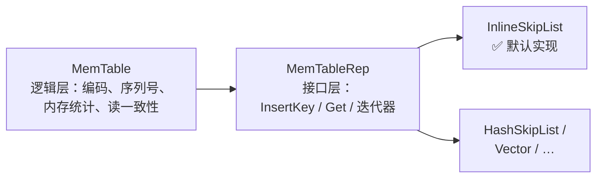
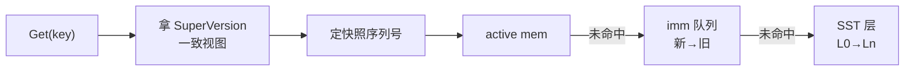

# 📘 数据通路（Data Path）：Put/Get 工作流与 InternalKey 编码

> RocksDB 源码精读 · 04 数据通路（Lab 2 前置） | 源码版本 [`e6a2ee0`](https://github.com/facebook/rocksdb/tree/e6a2ee0bd211489e64a45a6a0f6ce1dc67e195d7) | 本篇涵盖：Put/Get 完整工作流、三层可插拔设计、WriteBatch 物理格式、Get/SuperVersion 世界观
>
> 🧭 导读：本篇把 MemTable 的内存容器（跳表）当**黑盒**——只管数据怎么流进去、怎么查出来；跳表自身是什么、内部怎么工作，全在 [01-skiplist](01-skiplist.md)。**移交说明**：编码、回放、点查等 MemTable 内部细节（原知识点 4-8、10）已整节迁至 [05-memtable](05-memtable.md)，正文未动。

---

## 🧠 核心概念总览

- [*知识点1: Put 完整工作流（组提交）*](#id1)
- [*知识点2: 三层可插拔设计*](#id2)
- [*知识点3: 写批量(WriteBatch)的物理格式*](#id3)
- *（原知识点 4-8、10 —— 回放/编码/InternalKey/LookupKey/点查细节，已整节迁至 [05-memtable](05-memtable.md)）*
- [*知识点9: Get 完整工作流（SuperVersion 三级查找）*](#id9)

---

<a id="id1"></a>
## ✅ 知识点 1: Put 完整工作流（组提交）

**Put 不是一次函数调用...**

**一次 `Put` 的完整旅程（编号即顺序）**：

1. **打包**：`DBImpl::Put` 把操作装进 `WriteBatch`，进入 `WriteImpl`（[db_impl_write.cc:867](https://github.com/facebook/rocksdb/blob/e6a2ee0bd211489e64a45a6a0f6ce1dc67e195d7/db/db_impl/db_impl_write.cc#L867)）
    - 你调用 `db->Put(key, value)` 时，RocksDB 不会立刻写磁盘
    - 它先把你的 `key-value` 包进一个 `WriteBatch`（写批次）对象里
    - 然后进入内部的 `WriteImpl` 函数，这是写入路径的真正入口
2. **组队（组提交 Group Commit）**：`write_thread_.JoinBatchGroup(&w)`（[:1099](https://github.com/facebook/rocksdb/blob/e6a2ee0bd211489e64a45a6a0f6ce1dc67e195d7/db/db_impl/db_impl_write.cc#L1099)）——并发写线程在此汇合：**先到的当 leader，其余当 follower**
    - 多个线程同时调用 Put 时，它们都会跑到这里
    - 第一个到达的线程当 leader（队长），后面的线程当 follower（队员）
    - Follower 把它们的 `WriteBatch` 挂到 leader 的后面，然后阻塞等待
    > 类比：地铁闸机，第一个人刷卡后，后面几个人把票都给他，他统一刷卡，大家依次通过
3. **leader 预处理**：`PreprocessWrite`（[:1179](https://github.com/facebook/rocksdb/blob/e6a2ee0bd211489e64a45a6a0f6ce1dc67e195d7/db/db_impl/db_impl_write.cc#L1179)）——检查 MemTable 是否写满；若满则 `SwitchMemtable`（[:388](https://github.com/facebook/rocksdb/blob/e6a2ee0bd211489e64a45a6a0f6ce1dc67e195d7/db/db_impl/db_impl_write.cc#L388)）：当前 active 被 `MarkImmutable()` 打成只读、挂进 `imm_` 队列，另建一个新的 active
    - Leader 在真正写之前，先检查当前的 active MemTable（正在写的内存跳表）是否达到阈值
    - 如果满了：
        - 把当前的 active MemTable 标记为只读（`MarkImmutable()`）
        - 把它挂进 `imm_` 队列（`immutable memtable list`），等待后台线程 flush 到磁盘
        - 新建一个空的 active MemTable，供后续写入使用
4. **leader 写 WAL**：整组的 batch 合并后一次性 `WriteToWAL`（[:2262](https://github.com/facebook/rocksdb/blob/e6a2ee0bd211489e64a45a6a0f6ce1dc67e195d7/db/db_impl/db_impl_write.cc#L2262)）——**序列号在写 WAL 时统一分配**（[:1375](https://github.com/facebook/rocksdb/blob/e6a2ee0bd211489e64a45a6a0f6ce1dc67e195d7/db/db_impl/db_impl_write.cc#L1375) 注释）。**WAL 先落盘、MemTable 后更新，崩溃恢复依赖这个顺序**
    - Leader 把自己和所有 follower 的 `WriteBatch` 合并成一个大 batch
    - 然后调用 `WriteToWAL`，一次性把合并后的数据写到 WAL（预写日志）磁盘文件
    - 关键细节：
        - 序列号（sequence number）在此时统一分配，保证顺序
        - WAL 先落盘，MemTable 后更新——如果进程在 WAL 写完后、MemTable 更新前崩溃，恢复时可以通过重放 WAL 找回数据
5. **插 MemTable**：WAL 写完后，整组人（leader + followers）的 batch 数据需要插入到内存的 active MemTable（跳表）中，这里分了两种策略：
   - **非并发模式**：**Leader 一个人干**，leader 统一 replay 整组 batch
   - **并发模式（默认）**：**大家各自干**，leader 写完 WAL 放行，**follower 各自**调 `WriteBatchInternal::InsertInto`（[:1112-1117](https://github.com/facebook/rocksdb/blob/e6a2ee0bd211489e64a45a6a0f6ce1dc67e195d7/db/db_impl/db_impl_write.cc#L1112-L1117)），以 `concurrent_memtable_writes=true` **并发**插跳表——**这就是 InlineSkipList 必须做成无锁的根因**（详见 [01-skiplist](01-skiplist.md)）
6. **发布**：等全组人都把数据插进 MemTable 后 `versions_->SetLastSequence(last_sequence)`（[:1137](https://github.com/facebook/rocksdb/blob/e6a2ee0bd211489e64a45a6a0f6ce1dc67e195d7/db/db_impl/db_impl_write.cc#L1137)）——新序列号对读者可见，写入返回
    - RocksDB 用序列号（sequence number）实现 MVCC（多版本并发控制）。每个 key-value 在 `MemTable` 里都有一个 seq
    - 读线程读数据时，只读 `seq ≤ last_sequence` 的数据
    - 在 `SetLastSequence` 之前，虽然数据已经在 `MemTable` 里了，但读线程"看不到"——因为它们的 `seq` 大于当前的 `last_sequence`
    - 调用后，`last_sequence` 被推进到这组写入的最大 `seq`，**整组写入原子性对外可见**


**所以在全过程中起到关键作用的`memtable`到底是什么？**
- MemTable 在 RocksDB 里有两种身份：


    - **active**（`cfd->mem()`，[column_family.h:381](https://github.com/facebook/rocksdb/blob/e6a2ee0bd211489e64a45a6a0f6ce1dc67e195d7/db/column_family.h#L381)）：可读可写，**唯一**
    - **immutable 队列**（`cfd->imm()`，[:380](https://github.com/facebook/rocksdb/blob/e6a2ee0bd211489e64a45a6a0f6ce1dc67e195d7/db/column_family.h#L380)，类型 `MemTableList`）：**只读**，按新→旧排列，排队等后台 flush 成 SST

**"插入 MemTable"最终落到的就是跳表本身**：active MemTable 的容器正是 `InlineSkipList`：

- **插入链路的最后一跳**（第 5 步的代码特写，[skiplistrep.cc:46-48](https://github.com/facebook/rocksdb/blob/e6a2ee0bd211489e64a45a6a0f6ce1dc67e195d7/memtable/skiplistrep.cc#L46-L48)）：

    ```cpp
    bool InsertKey(KeyHandle handle) override {
    return skip_list_.Insert(static_cast<char*>(handle));
    }
    ```

    - `KeyHandle` 本质就是指向编码字节的裸指针 `char*`（内存由 **Arena 分配器**统一分配，见 [01-skiplist](01-skiplist.md)）
    - `static_cast` 零开销：设计契约是"调用方保证传进来的就是跳表分配的字节"

> 📍 **调用位置**：`SkipListRep::InsertKey` 的直接调用方是 `MemTable::Add`（[memtable.cc:1180](https://github.com/facebook/rocksdb/blob/e6a2ee0bd211489e64a45a6a0f6ce1dc67e195d7/db/memtable.cc#L1180)；并发走 [:1211](https://github.com/facebook/rocksdb/blob/e6a2ee0bd211489e64a45a6a0f6ce1dc67e195d7/db/memtable.cc#L1211) `InsertKeyConcurrently`）。从本知识点的 `InsertInto` 到它中间还有四跳：`InsertInto` → `Iterate` 逐条回调 → `PutCFImpl` → `mem->Add` → `table->InsertKey`——05 §KP6 逐跳展开。

> 💡 **理解技巧**：组提交把 N 个线程的 WAL 写合并成 1 次，摊薄昂贵的磁盘 IO；插跳表走无锁，把 CPU 并行度拉满——**串行化昂贵的，并行化便宜的**。
> ⚠️ **关键区分**：WAL 落盘 ≠ 数据可读。序列号经 `SetLastSequence` 发布后，这版数据才对读者可见。


---

<a id="id2"></a>
## ✅ 知识点 2: 三层可插拔设计

它在 RocksDB 里被谁包着、怎么被调用：**MemTable 管逻辑，MemTableRep 定接口，InlineSkipList 干苦力。**



**各层职责：**

- **MemTable（逻辑层）**：编码、序列号、内存统计、读一致性；对外由 `ColumnFamilyData` 持有为 `mem()` / `imm()` 两兄弟（[column_family.h:380-381](https://github.com/facebook/rocksdb/blob/e6a2ee0bd211489e64a45a6a0f6ce1dc67e195d7/db/column_family.h#L380-L381)）
- **MemTableRep（接口层）**：`InsertKey` / `Get` / 迭代器的纯抽象类（`include/rocksdb/memtablerep.h`）
- **InlineSkipList（实现层）**：真正的跳表；备选还有 HashSkipList、Vector 等

**默认配置**（[advanced_options.h:754-755](https://github.com/facebook/rocksdb/blob/e6a2ee0bd211489e64a45a6a0f6ce1dc67e195d7/include/rocksdb/advanced_options.h#L754-L755)）：

1. **策略模式解决"用什么"**：MemTable 只依赖 `MemTableRep` 接口，底层是跳表、哈希跳表还是 Vector 对它完全透明。运行时换配置就能切策略，代码不用改。

2. **工厂模式解决"怎么造"**：创建跳表需要传比较器、分配器等一堆参数，MemTable 不想管这些脏活。工厂把创建逻辑包起来，MemTable 只管调用 `CreateMemTableRep()` 拿成品用。

```cpp
std::shared_ptr<MemTableRepFactory> memtable_factory =
    std::shared_ptr<SkipListFactory>(new SkipListFactory);
```


---

<a id="id3"></a>
## ✅ 知识点 3: 写批量(WriteBatch)的物理格式
**MemTable 拿到数据后的第一件事是编码，而编码的源头是写批量——WriteBatch 长什么样**

- WriteBatch 是 RocksDB 的**最小写入事务单元**——WAL 存的是它，MemTable 回放的还是它
    
    - **本质是一段二进制字节串**  
        不是逻辑对象，是 `12字节头 + N条记录` 的紧凑二进制格式，直接往 WAL 里写

    - **头部 12 字节：sequence + count**  
        前 8 字节存这批写入的起始序列号，后 4 字节存有几条记录，后面紧跟具体数据。

    - **每条记录(record) = 类型标签 + 内容**  
        Put 是 `类型 + key + value`，Delete 是 `类型 + key`，Merge 类似；key/value 前面带长度前缀。

    - **存在的三个意义**  
        **原子性**（一批要么全写要么全不写）、**摊薄成本**（一批只写一次 WAL、统一分配序列号）、**崩溃恢复整批 replay**。


- 源码里的格式注释（[write_batch.cc:10-37](https://github.com/facebook/rocksdb/blob/e6a2ee0bd211489e64a45a6a0f6ce1dc67e195d7/db/write_batch.cc#L10-L37)）：

    ```
    WriteBatch::rep_ :=
        sequence: fixed64     ← 这批写入的起始序列号
        count:    fixed32     ← 批里有几条记录
        data:     record[count]
    record := kTypeValue varstring varstring    ← Put: key + value
            | kTypeDeletion varstring           ← Delete: 只有 key
            | kTypeMerge  varstring varstring   ← Merge 操作
            | ...（还有列族变体、事务 XID 等十余种）
    varstring := len: varint32 + data: uint8[len]
    ```

    - **头部长度是常量 `kHeader = 12`**（[write_batch_internal.h:82](https://github.com/facebook/rocksdb/blob/e6a2ee0bd211489e64a45a6a0f6ce1dc67e195d7/db/write_batch_internal.h#L82)）：8 字节 sequence + 4 字节 count
    - **WriteBatch 是"集装箱"**：整体是一段二进制字节串，包含 12 字节头部 + 一堆 record
        - RocksDB 允许你先 batch.Put(k1, v1)、batch.Delete(k2)，再 db.Write(batch)，这样一批里就有多个 record
        - 多个线程同时写时，RocksDB 会把它们攒成一个 WriteBatch 一起刷 WAL，减少磁盘 IO 次数
    - **record 是"集装箱里的货"**：每条 record 是一次具体操作（Put / Delete / Merge），是 WriteBatch 的组成部分

    - **count 告诉你有几件货**：WriteBatch 头部里的 `count` 字段，说明后面紧跟了多少条 record

    - **解析时逐个拆箱**：先读 12 字节头拿到 `count`，然后循环 `count` 次，每次按类型解析一条 record

> **一句话关系**：**WriteBatch 装 record，record 是 WriteBatch 的最小操作单元**


---

<a id="id9"></a>
## ✅ 知识点 9: Get 完整工作流（SuperVersion 三级查找）

一次 `Get` 的完整旅程就是先 **拿一张"一致视图"（SuperVersion），再按 新→旧 三级查找**（注意：实现由协程宏生成，真身在 [db_impl_sync_and_async.h](https://github.com/facebook/rocksdb/blob/e6a2ee0bd211489e64a45a6a0f6ce1dc67e195d7/db/db_impl/db_impl_sync_and_async.h)）：

1. **从`GetImpl`开始取视图**：`GetAndRefSuperVersion(cfd)`（[:126](https://github.com/facebook/rocksdb/blob/e6a2ee0bd211489e64a45a6a0f6ce1dc67e195d7/db/db_impl/db_impl_sync_and_async.h#L126)）固定住当前状态
    - `SuperVersion` "快照取景框" = 当前 `active mem` + `imm` 队列 + 当前 `Version（SST 集合）`的**一致快照**（结构定义 [column_family.h:208-214](https://github.com/facebook/rocksdb/blob/e6a2ee0bd211489e64a45a6a0f6ce1dc67e195d7/db/column_family.h#L208-L214)）
2. **定快照序列号** `snapshot_seq`：
    - 有用户指定的快照用指定快照；
    - 否则 `GetLastPublishedSequence()`（[:141-156](https://github.com/facebook/rocksdb/blob/e6a2ee0bd211489e64a45a6a0f6ce1dc67e195d7/db/db_impl/db_impl_sync_and_async.h#L141-L156)）
    - 源码注释点出一个微妙的并发正确性细节（[:151-155](https://github.com/facebook/rocksdb/blob/e6a2ee0bd211489e64a45a6a0f6ce1dc67e195d7/db/db_impl/db_impl_sync_and_async.h#L151-L155)）：**必须先引用 SuperVersion 再取序列号**
    - 否则两步之间发生 flush，可能把快照本应看到的数据 compact 掉
3. **拼探针**：`LookupKey lkey(key, snapshot, ...)`（[:201](https://github.com/facebook/rocksdb/blob/e6a2ee0bd211489e64a45a6a0f6ce1dc67e195d7/db/db_impl/db_impl_sync_and_async.h#L201)）
    - 用 `(user_key, snapshot_seq)` 拼一个假 `InternalKey`，格式和跳表里的一模一样，这样才能进 `MemTable` 做二分查找
4. **三级查找，新→旧**：
   - `sv->mem->Get(...)`：active MemTable（[:233](https://github.com/facebook/rocksdb/blob/e6a2ee0bd211489e64a45a6a0f6ce1dc67e195d7/db/db_impl/db_impl_sync_and_async.h#L233)）（刚写的，最热）
   - 未命中 → `sv->imm->Get(...)`——immutable 队列（[:251](https://github.com/facebook/rocksdb/blob/e6a2ee0bd211489e64a45a6a0f6ce1dc67e195d7/db/db_impl/db_impl_sync_and_async.h#L251)）（已冻结待 flush 的）
   - 再未命中 → `sv->current->Get(...)`——SST 层（[:296](https://github.com/facebook/rocksdb/blob/e6a2ee0bd211489e64a45a6a0f6ce1dc67e195d7/db/db_impl/db_impl_sync_and_async.h#L296)）（落盘数据）
   - 找到即返回，越新的数据查得越快
5. **每层内部**：`MemTable::Get` 的细节见 [05 §KP7](05-memtable.md#id7)



假设 key 是 `"name"`，时间线如下：

- `seq=1`：Put `"Alice"` → 被 flush 到 **SST**
- `seq=3`：Put `"Bob"` → 被 flush 到 **SST**  
- `seq=5`：Put `"Charlie"` → 在 **active mem**
- `seq=7`：Delete → 在 **active mem**


- **例 1：无快照 Get（最新视图，snapshot=7）**
    1. **取 SuperVersion**：固定住当前三件套（active mem 有 5、7 / SST 有 1、3）
    2. **定快照号**：拿到最新 published seq = **7**
    3. **拼探针**：`LookupKey("name", 7)`
    4. **查 active mem**：Seek 直接命中 `[name|seq=7|Delete]` → 发现是删除标记，**立刻返回 NotFound**
    5. **SST 根本不用碰** —— 最新的已经告诉你这 key 没了

- **例 2：快照 Get（snapshot=6，想读"那一刻"的数据）**

    1. **SuperVersion 同上**，但快照号固定为 **6**
    2. **拼探针**：`LookupKey("name", 6)`
    3. **查 active mem**：`[name|7]` 的 seq=7 > 6，对快照 6 来说"还没出生"，跳过；下一条 `[name|5]` 的 seq=5 ≤ 6，**命中，返回 "Charlie"**
    4. **不用查 SST** —— active mem 里已经有可见的最新版本
    5. **关键点**：seq 降序让 Seek 自动"穿过"不可见的新版本，直接落在可见版本上


> 💡 **理解技巧**：SuperVersion 是 MVCC 的"取景框"——读全程不加 DB 级大锁，靠引用计数固定住这一刻的 mem/imm/Version 三件套。
> 🔄 **知识关联**：第 4 步解释了为什么"刚写进的立刻能读到"——active 永远最先查；"刷盘后还能读到旧数据"靠的是 SST 层的版本接力

---


## 📌 面试速记版

| 面试题 | 一句话答 |
|---|---|
| 一次 Put 经历什么？ | WriteBatch 打包 → JoinBatchGroup 组提交（leader 预处理 + 统一写 WAL 分配 seq）→ 全组并发 InsertInto 跳表 → SetLastSequence 发布可见 |
| 为什么先写 WAL 再写 MemTable？ | 崩溃恢复靠重放 WAL；WAL 先落盘，MemTable 丢了也能找回 |
| MemTable 的两种身份？ | active 唯一可读可写；imm_ 只读队列按新→旧排队等 flush |
| 三层可插拔设计？ | MemTable 管逻辑 / MemTableRep 定接口 / InlineSkipList 干苦力——策略 + 工厂，容器可换 |
| WriteBatch 物理格式？ | 12 字节头（fixed64 sequence + fixed32 count）+ record[count]；record = 类型标签 + varstring key/value |
| 一次 Get 经历什么？ | 拿 SuperVersion 一致视图 → 定快照 seq → 拼 LookupKey → active → imm → SST 三级查找（新→旧） |
| SuperVersion 是什么？ | active + imm + Version 的一致快照，引用计数固定，读路径不加 DB 大锁；必须先引用再取 seq（防 flush 间隙） |

> （编码、回放、排序规则、LookupKey、MemTable::Get 细节的速记条目随正文迁至 [05-memtable](05-memtable.md) 📌）

**记忆口诀**：**"Put 组队 WAL 先行，seq 发布才算成；user 升序 seq 降序，Seek 一步见版本；Get 拿框三级找，新到旧、墓碑停。"**

---

**下一站**：本篇把跳表当黑盒用——只管把编码好的字节串 `Insert` 进去、`Seek` 出来。这个黑盒内部已在 [01-skiplist](01-skiplist.md) 拆开；下一站轮到 MemTable 本体——冻结与 flush 触发、容量管理、并发读写。→ 05-memtable（待写）

