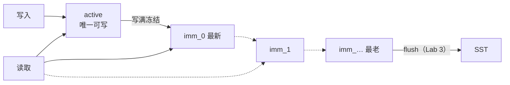

# 📘 MemTable：双态结构与内存读写路径（Active/Immutable & In-Memory Path）

> RocksDB 源码精读 · 05 MemTable | 源码版本 [`e6a2ee0`](https://github.com/facebook/rocksdb/tree/e6a2ee0bd211489e64a45a6a0f6ce1dc67e195d7) | 本篇涵盖：MemTable 定位、active/imm 双态结构、Entry 编码体系、WriteBatch 回放、点查内部、冻结与容量管理、并发读写、迭代器契约
>
> 🧭 导读：容器（[01-skiplist](01-skiplist.md)）、迭代器与扫描（[02](02-iterator.md) / [03](03-scan.md)）都已拆完，本篇轮到装它们的本体——MemTable。其中编码与读写细节（知识点 3-7）自 [04-data-path](04-data-path.md) 整节迁入，正文未做改动；双态生命周期、容量与并发（知识点 1-2、8-10）为本篇新写。

---

## 🧠 核心概念总览

**MemTable 是 LSM 写路径的内存关卡：写进来先落它（有序、可并发），写满了冻结成 imm 等 flush；读路径按 mem → imm → SST 从新到旧依次问。**

```
写入:  WriteBatch → 回放 → [active MemTable] --满--> [imm 列表] --flush--> SST(Lab 3)
读取:  key → active → imm(新→旧) → SST          （世界观见 04 §KP9）
```

- [*知识点1: MemTable 的定位——写路径第一站*](#id1)
- [*知识点2: 双态结构——active + immutable 列表*](#id2)
- [*知识点3: Entry 编码与 varint32*](#id3)
- [*知识点4: PackSequenceAndType 位布局*](#id4)
- [*知识点5: InternalKeyComparator 排序规则*](#id5)
- [*知识点6: WriteBatch → Node：逐条回放进跳表*](#id6)
- [*知识点7: 点查：LookupKey 与 MemTable::Get 内部*](#id7)
- [*知识点8: 冻结与容量管理——ShouldFlushNow 与 SwitchMemtable*](#id8)
- [*知识点9: 并发读写——读不拿锁，写分两派*](#id9)
- [*知识点10: 迭代器契约——MemTable 层给上层什么*](#id10)

---

<a id="id1"></a>
## ✅ 知识点 1: MemTable 的定位——写路径第一站

**LSM 的核心思想是"随机写变顺序写"：写入不直接碰磁盘文件，先落进内存里的有序结构 MemTable，攒够一批再顺序刷盘。MemTable 就是这个内存有序结构的逻辑本体。**

- **写路径的位置**：`Put` 的工作流（[04 §KP1](04-data-path.md#id1)）是 WAL 落盘 → 回放进 MemTable——MemTable 是写路径在内存的终点，也是读路径的起点
- **读路径的位置**：Get 的世界观（[04 §KP9](04-data-path.md#id9)）按 mem → imm → L0 → Ln 从新到旧找，前两级都是 MemTable
- **它不管的事**：落盘格式（SST，Lab 3）、多版本归并给用户看（DBIter，[02 §KP5](02-iterator.md#id5)）、崩溃恢复（WAL 重放走同一套回放逻辑，见本篇知识点 6）

> 💡 **理解技巧**：MemTable 回答的问题只有一个——**"最近写入的数据，在内存里怎么组织才又快又有序？"** 答案是：可插拔容器（默认跳表）+ 一套编码约定 + 双态生命周期。

---

<a id="id2"></a>
## ✅ 知识点 2: 双态结构——active + immutable 列表

**同一时刻只有一个 active MemTable 可写；写满后被冻结成 immutable（只读），排进 imm 列表等 flush；读操作要同时查 active 和整个 imm 列表。**

- **active**：`cfd->mem()`，当前唯一接受写入的 MemTable
- **imm 列表**：`cfd->imm()`，类型 `MemTableList`（[memtable_list.h:268](https://github.com/facebook/rocksdb/blob/e6a2ee0bd211489e64a45a6a0f6ce1dc67e195d7/db/memtable_list.h#L268)）。冻结的表从**头部**插入——`AddMemTable` 就是 `memlist_.push_front(m)`（[memtable_list.cc:107-114](https://github.com/facebook/rocksdb/blob/e6a2ee0bd211489e64a45a6a0f6ce1dc67e195d7/db/memtable_list.cc#L107-L114)），所以**列表序 = 新到旧序**，查找顺列表走天然满足"新的优先"
- **版本化**：列表本体包在 `MemTableListVersion`（[memtable_list.h:58](https://github.com/facebook/rocksdb/blob/e6a2ee0bd211489e64a45a6a0f6ce1dc67e195d7/db/memtable_list.h#L58)）里——一份不可变的"列表快照"，引用计数管理；SuperVersion 钉住它，读者拿到的视图就不会在读取途中被 flush 抽走（呼应 [04 §KP9](04-data-path.md#id9)）
- **flush 与双态的关系**：imm 表只进不出，直到后台 flush 把它们写成 SST 再摘除（选取与摘除归 Lab 3，本篇只到"谁被冻、谁等着"）



> ⚠️ **关键区分**：active 与 imm 里存的是**同一种东西**（编码字节串进跳表），区别只在生命周期状态——可写 vs 只读等 flush。读路径不区分它们，按新到旧逐个问（`GetFromList`，[memtable_list.cc:230](https://github.com/facebook/rocksdb/blob/e6a2ee0bd211489e64a45a6a0f6ce1dc67e195d7/db/memtable_list.cc#L230)）。

---

<a id="id3"></a>
## ✅ 知识点 3: Entry 编码与 varint32

**batch replay 之后，每条记录进 MemTable 时怎么编码**

- **MemTable 里存的不是原始 key，是一段"打包好的字节串"：长度前缀 + key + 8 字节版本标签 + 长度前缀 + value**
    - **8 字节 `packed` 是"身份证"**: 把序列号（`seq`）和操作类型（`Put/Delete`）打包成 8 字节塞在 `key` 和 `value` 中间，用来区分同 一 `key` 的不同版本

- `MemTable::Add` 的编码（格式注释 [memtable.cc:1122-1127](https://github.com/facebook/rocksdb/blob/e6a2ee0bd211489e64a45a6a0f6ce1dc67e195d7/db/memtable.cc#L1122-L1127)，实现 [:1142-1152](https://github.com/facebook/rocksdb/blob/e6a2ee0bd211489e64a45a6a0f6ce1dc67e195d7/db/memtable.cc#L1142-L1152)）：

    ```cpp
    // Format of an entry is concatenation of:
    //  key_size     : varint32 of internal_key.size()
    //  key bytes    : char[internal_key.size()]
    //  value_size   : varint32 of value.size()
    //  value bytes  : char[value.size()]
    // 把 internal_key_size 这个整数，用 VarInt 的方式写进内存
    char* p = EncodeVarint32(buf, internal_key_size);
    // 把真正的 key 内容复制到刚才那个位置后面
    memcpy(p, key.data(), key_size);
    ...
    // seq + type 打包成 uint64_t 版本信息
    uint64_t packed = PackSequenceAndType(s, type);
    // 将版本信息固定写入 8 bytes
    EncodeFixed64(p, packed);
    ```

    ```
    | varint32 key_size | key bytes | 8B packed(seq+type) | varint32 val_size | value bytes | [checksum] |
    ```

- **为什么用 varint32 存长度？省空间**

    - RocksDB 怎么知道 key/val 有多长，需要一个 `key_size`，`value_size` 告知
    - **VarInt32 用小数值少占字节，绝大多数 key/value 长度很短，百万条记录能省 MB 级内存。**
        - `varint32`： value或key长度 ≤127 时只占 **1 字节**
        - `fixed32` 恒占 **4 字节**
    - 同一套 varint 编码也用在 LevelDB / Protocol Buffers 里
- **`internal key` 又是什么？** 
    - RocksDB 有 `User Key` 比如 `"name"`
    - `Internal Key` =  `User Key ` + ` 8-byte packed`
    - 存储是真正使用的 'key'

> ⚠️ **关键区分**：跳表存的 key **不是**原始用户 key，而是这段编码字节串（含 seq + type）。
> 📋 **术语提醒**：`varint(可变长整数)`——小数值少占字节，以 CPU 换空间，是存储系统的常规武器。

---
<a id="id4"></a>
## ✅ 知识点 4: PackSequenceAndType 位布局

**编码里那 8 字节 `packed` 到底装了什么？**

- **序列号和记录类型被压进 8 字节：高 56 位是序列号，低 8 位是类型**[dbformat.h:181-186](https://github.com/facebook/rocksdb/blob/e6a2ee0bd211489e64a45a6a0f6ce1dc67e195d7/db/dbformat.h#L181-L186)：

    ```cpp
    // 左移 8 位给 type 腾座位，或运算把它塞进去；
    // 拆的时候右移还原 seq，掩码抠出 type
    inline uint64_t PackSequenceAndType(uint64_t seq, ValueType t) {
    assert(seq <= kMaxSequenceNumber);
    assert(IsExtendedValueType(t) || t == kTypeMaxValid);
    return (seq << 8) | t;
    }
    ```

    - 解包对称（[dbformat.h:190-194](https://github.com/facebook/rocksdb/blob/e6a2ee0bd211489e64a45a6a0f6ce1dc67e195d7/db/dbformat.h#L190-L194)）：
        1. `seq = packed >> 8`：整体右移 8 位，扔掉 `type`，还原 `seq`
        2. `type = packed & 0xff`：`0xFF` 是 `11111111`，只保留低 8 位，抠出 `type`
    - **位布局决定排序**：packed 值大 ⇔ seq 大（type 只在 seq 相同时起决胜作用）——知识点 5 的排序规则建立在这上面
    - `ValueType` 常见值：`kTypeValue`（正常值）、`kTypeDeletion`（点删除墓碑）、`kTypeMerge`（合并操作）

> ⚠️ **关键区分**：这 8 字节**跟在 user key 后面**，构成**内部键**(InternalKey)的尾部——跳表排序看的是整个 InternalKey，不是裸 user key

---
<a id="id5"></a>
## ✅ 知识点 5: InternalKeyComparator 排序规则

**packed 的位布局直接决定了跳表的排序规则**

- **排序三关键字：先 `user key` 升序 → 再 `seq` 降序 → 然后 `type` 降序，`seq` 降序是让"查找恰好落在可见版本上"的关键** 源码注释原文（[dbformat.cc:201-204](https://github.com/facebook/rocksdb/blob/e6a2ee0bd211489e64a45a6a0f6ce1dc67e195d7/db/dbformat.cc#L201-L204)）：

    ```cpp
    // Order by:
    //    increasing user key (according to user-supplied comparator)
    //    decreasing sequence number
    //    decreasing type (though sequence# should be enough to disambiguate)
    ```

- **多版本在跳表里的物理布局**（以 user key `"name"` 写过三次为例）：

    ```
    跳表中的排列（comparator 序）：
    [name|seq=7] -> [name|seq=5] -> [name|seq=3] -> [下一个 user key] -> ...
    ^
    最新版本永远排在同 key 的最前面

    查找 name @ 快照 seq=6：
    LookupKey = (name, 6, kValueTypeForSeek)
    按排序规则，它"假想"的位置卡在 seq=7 和 seq=5 之间
    Seek → 第一个 ≥ LookupKey 的条目 = [name|seq=5] ✔ 恰好是可见的最新版本
    ```
    - **查找时"卡位"直接命中**：
        1. 快照 `seq=6` 想读 `"name"`，RocksDB 构造一个假想的 `(name, 6)` 去跳表 `Seek`
        2. 因为 `seq` 降序，这个位置刚好卡在 `7` 和 `5` 之间，`Seek` 返回的第一个有效记录就是 `[name|5]`
        3. 即对 `seq=6` 可见的最新版本, 快照 `seq=6` 的规则是"只认 `≤6` 的版本"


> 💡 **理解技巧**：seq 降序的精妙之处——**一次 Seek 直接命中可见版本**，不用先找到最新再往回退。
> 🔄 **知识关联**：`kValueTypeForSeek = kTypeValuePreferredSeqno`（[dbformat.cc:28](https://github.com/facebook/rocksdb/blob/e6a2ee0bd211489e64a45a6a0f6ce1dc67e195d7/db/dbformat.cc#L28)），与 preferred seqno 读优化有关，细节这里不展开。


---
<a id="id6"></a>
## ✅ 知识点 6: WriteBatch → Node：逐条回放进跳表

**新疑问：WAL 写完之后，这串字节怎么变成跳表里的一个个 Node？**

- **入口：`WriteBatchInternal::InsertInto`**（[:3274-3306](https://github.com/facebook/rocksdb/blob/e6a2ee0bd211489e64a45a6a0f6ce1dc67e195d7/db/write_batch.cc#L3274-L3306)，组提交 leader 统一回放路径；[:3308-3335](https://github.com/facebook/rocksdb/blob/e6a2ee0bd211489e64a45a6a0f6ce1dc67e195d7/db/write_batch.cc#L3308-L3335)，并发模式每人各跑一份）：

    ```cpp
    MemTableInserter inserter(sequence, memtables, ...);
    SetSequence(writer->batch, sequence);          // 把分到的起始 seq 写回 batch 头
    Status s = writer->batch->Iterate(&inserter);  // 启动逐条回放
    if (concurrent_memtable_writes) {
    inserter.PostProcess();                      // 并发模式的统计收尾
    }
    ```

- **三件事**：
    1. 造一个回放器（`MemTableInserter`）
    2. 把 leader 分到的起始序列号写回 batch 头部那个 fixed64 字段（正是 04 §KP3 格式里的 `sequence`）
    3. `MemTableIterater` 开拆

- **拆箱：`Iterate` 顺序扫字节串，逐条回调**（[:518-525](https://github.com/facebook/rocksdb/blob/e6a2ee0bd211489e64a45a6a0f6ce1dc67e195d7/db/write_batch.cc#L518-L525) → [:527](https://github.com/facebook/rocksdb/blob/e6a2ee0bd211489e64a45a6a0f6ce1dc67e195d7/db/write_batch.cc#L527) 起）：

    - `rep_` 字节串的格式只有 WriteBatch 自己懂
    - 所以遍历逻辑由它提供：每解析出一条 record（读 tag → 读 varstring key → 读 varstring value），就调用 handler 对应的方法（`PutCF` / `DeleteCF` / `MergeCF`……）
    - `inserter` 负责编码 + 插入回调里把 `user_key + seq + type + value` 编码成 `InternalKey`
    - 走 `MemTableRep::Allocate` 拿内存块，再 `Insert` 进跳表
- 💡 这是 **Visitor 模式**（访问者模式）：  
    - `WriteBatch` 只管"遍历拆箱"（遍历逻辑固定）
    - `inserter` 只管"怎么处理"（回放进 `MemTable`、打印调试、统计大小各挂各的 `handler`）
    - 回放场景挂的 handler 就是 `MemTableInserter`

**发号：`MemTableInserter` 每条 record 发一个序列号**（[:2025](https://github.com/facebook/rocksdb/blob/e6a2ee0bd211489e64a45a6a0f6ce1dc67e195d7/db/write_batch.cc#L2025)）：

- 它持有 `sequence_`，从 batch 的起始 seq 开始；默认 **seq_per_key**——每处理一条 record，`MaybeAdvanceSeq()` 里 `sequence_++`（[:2208-2212](https://github.com/facebook/rocksdb/blob/e6a2ee0bd211489e64a45a6a0f6ce1dc67e195d7/db/write_batch.cc#L2208-L2212)）
- 这就是 04 §KP1 第 4 步"写 WAL 时统一分配序列号"的**落点**：WAL 里只存 batch 的起始 seq，逐条的 seq 在回放时现场递增发出——batch 内第 i 条 record 拿到 `起始seq + i`
- 回调核心（以 Put 为例，`PutCFImpl` [:2285](https://github.com/facebook/rocksdb/blob/e6a2ee0bd211489e64a45a6a0f6ce1dc67e195d7/db/write_batch.cc#L2285)）：取出当前列族（Column Family，可理解为逻辑分库）的 MemTable（[:2315](https://github.com/facebook/rocksdb/blob/e6a2ee0bd211489e64a45a6a0f6ce1dc67e195d7/db/write_batch.cc#L2315)），调 `mem->Add(sequence_, kTypeValue, key, value, ...)`（[:2322](https://github.com/facebook/rocksdb/blob/e6a2ee0bd211489e64a45a6a0f6ce1dc67e195d7/db/write_batch.cc#L2322)）

**落地：`MemTable::Add` 四步**（[memtable.cc:1116-1219](https://github.com/facebook/rocksdb/blob/e6a2ee0bd211489e64a45a6a0f6ce1dc67e195d7/db/memtable.cc#L1116-L1219)）：

```cpp
// ① 算长度：varint(key_size) + key + 8B packed + varint(value_size) + value
const uint32_t encoded_len = VarintLength(internal_key_size) + ...;
KeyHandle handle = table->Allocate(encoded_len, &buf);   // ② 拿地
char* p = EncodeVarint32(buf, internal_key_size);        // ③ 编码写入 buf
...
// ④ 挂链：非并发 InsertKey / 并发 InsertKeyConcurrently
```

- **② 拿地**：`SkipListRep::Allocate`（[skiplistrep.cc:35-38](https://github.com/facebook/rocksdb/blob/e6a2ee0bd211489e64a45a6a0f6ce1dc67e195d7/memtable/skiplistrep.cc#L35-L38)）就一行：`*buf = skip_list_.AllocateKey(len)` → `AllocateNode(len, RandomHeight())`——**01 知识点 2 的三段式 Node 在这里从 Arena 切出**，身高已随机、已用 StashHeight 暂存好（这个"临时便签"机制在 [01 知识点 2](01-skiplist.md#id2) 有专段讲解），返回的 `buf` 正是 key 区起点
- **③ 编码**：往 buf 里按格式写字节——逐字段细节见本篇知识点 3
- **④ 挂链分流**：`concurrent_memtable_writes` 决定走 `InsertKey`（[:1180](https://github.com/facebook/rocksdb/blob/e6a2ee0bd211489e64a45a6a0f6ce1dc67e195d7/db/memtable.cc#L1180) → `skip_list_.Insert`）还是 `InsertKeyConcurrently`（[:1211](https://github.com/facebook/rocksdb/blob/e6a2ee0bd211489e64a45a6a0f6ce1dc67e195d7/db/memtable.cc#L1211) → `skip_list_.InsertConcurrently`）——**01 知识点 7 的"非并发 SetNext"与"CAS 链接"两条路径在这里分道**，也正是 04 §KP1 第 5 步"两种策略"的落地


> 📋 **术语提醒**：`sequence_` 是回放器手里的"发号机读数"，随每条 record 递增；batch 头里那个 fixed64 只是起始值。
> ⚠️ **关键区分**：WAL 里的 seq 是**批次起始值**；跳表里每条 entry 的 seq 是**回放时逐条递增**发出的。崩溃恢复重放 WAL 时走同一套 InsertInto 逻辑，seq 严格重现。
> 💡 **理解技巧**：这条链上每一环都是别的知识点埋的钩子——04 §KP3 的字节串格式、本篇知识点 3 的编码、01 的 AllocateNode 与 CAS 链接。看懂这一节，01、04 与本篇就焊死了。


---
<a id="id7"></a>
## ✅ 知识点 7: 点查：LookupKey 与 MemTable::Get 内部

**排序规则定了，查找时拿什么当"探针"去 Seek？Seek 命中之后又怎么逐版本判可见性？本节两段：先造探针（LookupKey），再看 `MemTable::Get` 的五道关卡。**

- RocksDB 查找一个 `key` 时，需要构造一个临时的 `InternalKey`，然后拿它去 `Seek()` 找位置，跳表不认识裸 key
    - RocksDB 只认 `InternalKey` 格式的字节串；`LookupKey` 就是临时伪造一张"同格式工牌"混进去找人的。
    - **`LookupKey`格式**：`userkey` 长度 + `userkey` 内容 + 8 字节(`seq`+`type`)

- **`LookupKey` 布局**（[lookup_key.h:47-57](https://github.com/facebook/rocksdb/blob/e6a2ee0bd211489e64a45a6a0f6ce1dc67e195d7/db/lookup_key.h#L47-L57)）：

    ```
    | varint32 klength | userkey bytes | 8B tag = Pack(seq, kValueTypeForSeek) |
    ^                     ^                                                       ^
    start_               kstart_                                               end_
    ```

    - **构造实现**：[dbformat.cc:245-266](https://github.com/facebook/rocksdb/blob/e6a2ee0bd211489e64a45a6a0f6ce1dc67e195d7/db/dbformat.cc#L245-L266)
    - **工程细节**：这个临时 `InternalKey` 本来可以用 `malloc` 动态申请内存，但 `RocksDB` 发现 key 通常很短、而且这个操作非常频繁
    - 所以它直接在栈上准备一个 `char space_[200]`，相当于准备了一个临时小盒子，大多数 key 直接放进去，直接塞栈里，不用 malloc，用完自动释放
        - `start_` 指向整段开头（含长度前缀）→ `memtable_key()` 用
        - `kstart_` 指向 `userkey` 开头 → `internal_key()` 用
        - `end_` 指向末尾，同一段内存两个视图，零拷贝
    - `memtable_key()` 返回从 `start_` 起的整段；`internal_key()` 返回从 `kstart_` 起的后缀——**同一段内存，两个视图**

> 💡 **理解技巧**：栈上小缓冲区（SSO 思想/Small String/Buffer optimization）是高频小对象的标准优化——Get 是热路径，省一次 malloc 就是省一次潜在的缓存未命中。

---

**探针造好了，看它怎么用——`MemTable::Get` 内部细节：**

**[04 §KP9](04-data-path.md#id9) 三级查找里每一级的 `MemTable::Get` 内部又做了什么？**

- **进跳表之前先问 Bloom；命中之后逐版本判可见性；读到墓碑立即短路**
    - bloom filter 实现： 一个 bit 数组 + 多个哈希函数。插入时把元素用几个哈希函数映射到数组位置，全置为 1；查询时看这些位是否都为 1
    - 如果都为1 表示可能有，否则一定没有

- `MemTable::Get` 的流程（[memtable.cc:1568-1647](https://github.com/facebook/rocksdb/blob/e6a2ee0bd211489e64a45a6a0f6ce1dc67e195d7/db/memtable.cc#L1568-L1647)）：
    1. **空表直接走人**  
   先 `IsEmpty()`，MemTable 里啥都没有就直接返回 NotFound，不浪费时间。

   2. **范围删除检查**：`MaxCoveringTombstoneSeqnum`（range tombstone 走独立结构，不占点查询路径）：检查 `range tombstome` 是否覆盖了正在查找的`key`

    3. **Bloom Filter 挡第一关**  
   MemTable 自己也有 Bloom Filter `bloom_filter_`（不是 SST 专属）。问一遍：如果说"肯定不存在"，直接返回，**跳表都不用进**，省一次 O(log n) 的 Seek。

    4. **进跳表 Seek，逐版本回调**  
    `GetFromTable`（[:1649](https://github.com/facebook/rocksdb/blob/e6a2ee0bd211489e64a45a6a0f6ce1dc67e195d7/db/memtable.cc#L1649)）→ 用 LookupKey Seek 命中后，从最新版本往回扫，每条记录回调 `SaveValue`：检查 seq ≤ 快照号（可见？）、检查类型（值/删除/合并）
        - 跳表按 `user_key `+` seq` 排序，`Seek` 用 `LookupKey` 卡位后，落点可能是 `seq` 比你大的新版本（对快照不可见），所以落点附近可能有多条同名记录

> 📍 **调用位置**：`GetFromTable` 的最后一跳是 `table_->Get(key, &saver, SaveValue)`（[memtable.cc:1684](https://github.com/facebook/rocksdb/blob/e6a2ee0bd211489e64a45a6a0f6ce1dc67e195d7/db/memtable.cc#L1684)）——对默认跳表 rep 即 `SkipListRep::Get`（[skiplistrep.cc:85-93](https://github.com/facebook/rocksdb/blob/e6a2ee0bd211489e64a45a6a0f6ce1dc67e195d7/memtable/skiplistrep.cc#L85-L93)）：现场建迭代器 → Seek → 逐条回调 `SaveValue`（[:90-91](https://github.com/facebook/rocksdb/blob/e6a2ee0bd211489e64a45a6a0f6ce1dc67e195d7/memtable/skiplistrep.cc#L90-L91)）。至此读路径钻到最里层，与 [04 §KP2](04-data-path.md#id2) 的"MemTableRep 定接口"闭环。

    5. **墓碑短路：读到删除标记立刻停**  
    如果碰到 `kTypeDeletion`（墓碑），说明这 key 被删了，**立刻返回 NotFound**，不用继续往下翻旧版本。
        - 墓碑是同一个 `key` 在 `MemTable` 里的最新可见状态，旧版本已被它物理覆盖，往下翻不可能翻出活口

    6. **Merge 特殊处理**  
   如果读到的是 Merge 操作，不直接返回值，而是标记 `MergeInProgress`，留给上层把多个 Merge 记录合并成最终结果。


**一句话记忆**：先问 Bloom 省 CPU，再进跳表逐版本判，墓碑直接短路，Merge 留给上层。


> ⚠️ **关键区分**：MemTable 也有自己的 Bloom Filter——不是 SST 专利，省的是进跳表 Seek 的 CPU。
> 📋 **术语提醒**：`tombstone(墓碑)` = 删除操作写入的特殊记录，读时判死、Compaction 时才真正清理。

---

---

<a id="id8"></a>
## ✅ 知识点 8: 冻结与容量管理——ShouldFlushNow 与 SwitchMemtable

**active 表什么时候算"写满"？满了之后谁把它冻起来、新表谁接上？**

- **容量记账**：`MemTable::ApproximateMemoryUsage`（[memtable.cc:276-293](https://github.com/facebook/rocksdb/blob/e6a2ee0bd211489e64a45a6a0f6ce1dc67e195d7/db/memtable.cc#L276-L293)）= Arena + 跳表 + 区间墓碑表 + insert hints 四份合计，结果缓存进 `approximate_memory_usage_`（relaxed 原子，[memtable.h:977](https://github.com/facebook/rocksdb/blob/e6a2ee0bd211489e64a45a6a0f6ce1dc67e195d7/db/memtable.h#L977)）
- **满没满**：`ShouldFlushNow`（[memtable.cc:295-367](https://github.com/facebook/rocksdb/blob/e6a2ee0bd211489e64a45a6a0f6ce1dc67e195d7/db/memtable.cc#L295-L367)）拿记账值和 `write_buffer_size` 比。麻烦在 Arena 按块分配、块大小未必整除 buffer size，所以判据带两个工程常数：
  - **0.6 超配系数**（[:316](https://github.com/facebook/rocksdb/blob/e6a2ee0bd211489e64a45a6a0f6ce1dc67e195d7/db/memtable.cc#L316)）：还能再分一块而不超出 `write_buffer_size + 0.6×块` 就不算满；反过来已超配过头则立刻算满
  - **末块 0.75 规则**（[:366](https://github.com/facebook/rocksdb/blob/e6a2ee0bd211489e64a45a6a0f6ce1dc67e195d7/db/memtable.cc#L366)）：Arena 已在用最后一块时，余量不足 1/4 块就判满——避免下一条 entry 塞不下时白白浪费（注释 [:341-365](https://github.com/facebook/rocksdb/blob/e6a2ee0bd211489e64a45a6a0f6ce1dc67e195d7/db/memtable.cc#L341-L365) 给了完整推导）
- **冻结动作**：写路径发现满了 → `DBImpl::SwitchMemtable`（[db_impl_write.cc:3118](https://github.com/facebook/rocksdb/blob/e6a2ee0bd211489e64a45a6a0f6ce1dc67e195d7/db/db_impl/db_impl_write.cc#L3118)）五步：
  1. **造新表** `ConstructNewMemtable`（[:3245](https://github.com/facebook/rocksdb/blob/e6a2ee0bd211489e64a45a6a0f6ce1dc67e195d7/db/db_impl/db_impl_write.cc#L3245)）
  2. **冻结旧表** `MarkImmutable`（[:3260](https://github.com/facebook/rocksdb/blob/e6a2ee0bd211489e64a45a6a0f6ce1dc67e195d7/db/db_impl/db_impl_write.cc#L3260)，幂等）
  3. **旧表进 imm 列表** `imm()->Add`（[:3395](https://github.com/facebook/rocksdb/blob/e6a2ee0bd211489e64a45a6a0f6ce1dc67e195d7/db/db_impl/db_impl_write.cc#L3395)，push_front，知识点 2）
  4. **新表上岗** `SetMemtable`（[:3411](https://github.com/facebook/rocksdb/blob/e6a2ee0bd211489e64a45a6a0f6ce1dc67e195d7/db/db_impl/db_impl_write.cc#L3411)）
  5. **发布新视图** `InstallSuperVersionAndScheduleWork`（[:3412](https://github.com/facebook/rocksdb/blob/e6a2ee0bd211489e64a45a6a0f6ce1dc67e195d7/db/db_impl/db_impl_write.cc#L3412)）——之后的读者看到"新 active + 旧表在 imm"的世界
- **flush 契约**（细节归 Lab 3）：imm 表只读、只进不出；后台 flush 选最老的若干张写成 SST 后摘除（`PickMemtablesToFlush`，[memtable_list.h:337](https://github.com/facebook/rocksdb/blob/e6a2ee0bd211489e64a45a6a0f6ce1dc67e195d7/db/memtable_list.h#L337)）

> 💡 **理解技巧**：冻结是**换表不是搬数据**——旧表原地变只读进 imm，新表从空开始接写，写线程几乎无感。代价全推给后台 flush，这正是 LSM"前台写快"的又一处体现。
> ⚠️ **关键区分**：`write_buffer_size` 管**单张表**的容量；imm 列表**张数**另有上限（`max_write_buffer_number`），超了触发写停顿（write stall）——两者别混。

---

<a id="id9"></a>
## ✅ 知识点 9: 并发读写——读不拿锁，写分两派

**读路径全程无锁；写路径分"组提交单写者"与"并发写跳表"两种模式，并发安全分别由视图钉住和 CAS 保证。**

- **读为什么不拿锁**（三柱合谋，逐层都有出处）：
  1. SuperVersion 钉住 mem/imm 视图（[04 §KP9](04-data-path.md#id9)），读取途中列表不会被换走
  2. imm 表只读，active 表只增不改——节点不可变
  3. 跳表本体无锁读（[01 §KP6](01-skiplist.md#id6)/[§KP8](01-skiplist.md#id8)：release 发布 + acquire 订阅 + Arena 保活）
- **写的第一派：组提交单写者**——leader 统一回放 WriteBatch，同一时刻只有一个线程插跳表，普通 `SetNext` 就够（[04 §KP1](04-data-path.md#id1)）
- **写的第二派：`concurrent_memtable_writes=true`**——follower 各自回放、并发插同一张跳表，靠 CAS 链接保证正确（[01 §KP7](01-skiplist.md#id7)）；这也是 InlineSkipList 必须无锁的根因
- **特例才用锁**：`GetLock`（[memtable.cc:1032](https://github.com/facebook/rocksdb/blob/e6a2ee0bd211489e64a45a6a0f6ce1dc67e195d7/db/memtable.cc#L1032)）给特定 key 区间上读写锁，只服务 in-place update 尝试等少数路径，不在普通 Put/Get 热路径上

> 💡 **理解技巧**：RocksDB 的并发哲学——**热路径无锁化，锁只守冷角落**。读靠不可变 + 发布订阅，写靠 CAS，只有特殊的原地更新才摸锁。

---

<a id="id10"></a>
## ✅ 知识点 10: 迭代器契约——MemTable 层给上层什么

**MemTable 对扫描只承诺一件事：按 InternalKeyComparator 序吐出全部条目（含所有版本与墓碑），其余语义都是上层的。**

- **造迭代器**：`MemTable::NewIterator`（[memtable.cc:742-751](https://github.com/facebook/rocksdb/blob/e6a2ee0bd211489e64a45a6a0f6ce1dc67e195d7/db/memtable.cc#L742-L751)）在 arena 里 placement-new 一个 `MemTableIterator`——包装与解码细节见 [02 §KP2](02-iterator.md#id2)
- **imm 列表同等待遇**：`MemTableListVersion::AddIterators`（[memtable_list.cc:289](https://github.com/facebook/rocksdb/blob/e6a2ee0bd211489e64a45a6a0f6ce1dc67e195d7/db/memtable_list.cc#L289)）给每张 imm 各造一个迭代器，和 active 的一起交给归并器（[02 §KP4](02-iterator.md#id4)）
- **吐出的形态**：编码后的 internal key 字节流（知识点 3 的格式），**不做**版本去重、**不消化**墓碑——那是 DBIter 的活（[02 §KP5](02-iterator.md#id5)）
- **边界语义**：前缀提前止损靠入口 bloom（[03 §KP2](03-scan.md#id2) 的伏笔就在 MemTableIterator 构造里），区间截断靠上层谓词——MemTable 层只管"有序吐全量"

> 🔄 **知识关联**：点查与扫描在 MemTable 层共用同一条 Seek 通道（[01-skiplist](01-skiplist.md) §KP6 📍）——Get 是"Seek 一次 + 逐版本回调"，扫描是"Seek 定位 + 一路 Next"，底层都是跳表迭代器。

---

## 📌 面试速记版

| 问题 | 一句话答案 |
|------|-----------|
| MemTable 是什么？ | LSM 写路径的内存有序结构：active 可写 + imm 列表只读等 flush，默认跳表实现 |
| 为什么读 memtable 不拿锁？ | SuperVersion 钉住视图 + imm 只读节点不可变 + 跳表 release/acquire 无锁读，三者合谋 |
| 写满怎么判？ | ApproximateMemoryUsage 记账 vs write_buffer_size；Arena 块分配引入 0.6 超配系数与末块 0.75 规则 |
| 冻结动作是什么？ | SwitchMemtable 五步：造新表 → MarkImmutable → 旧表进 imm → 新表上岗 → 发布新 SuperVersion |
| entry 在跳表里长什么样？ | varint32 key 长度 + internal key（user key + 8B seq/type）+ varint32 value 长度 + value |
| 排序规则？ | user key 升序 → seq 降序 → type 降序；seq 降序让 Seek 卡位直接命中可见版本 |
| MemTable 也有 bloom？ | 有，挡在进跳表 Seek 之前，省 CPU 不省 IO |
| 点查五道关？ | 空表走人 → range tombstone → bloom → Seek 逐版本回调 → 墓碑短路（Merge 留上层） |
| 迭代器吐什么？ | 按 comparator 序吐全部版本含墓碑的编码字节流；去重与墓碑消化归 DBIter |

**记忆口诀**：**"一活多冻新到旧，编码三段 varint 头；回放发号逐条进，卡位 Seek 墓碑收；满了冻结换张表，读无锁来写两派。"**
