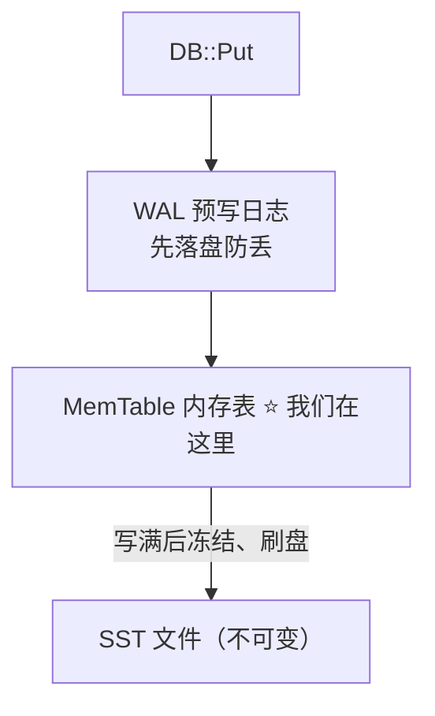
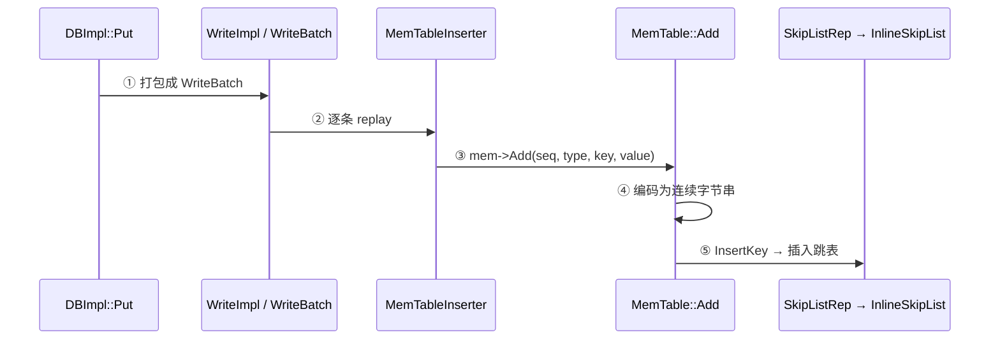
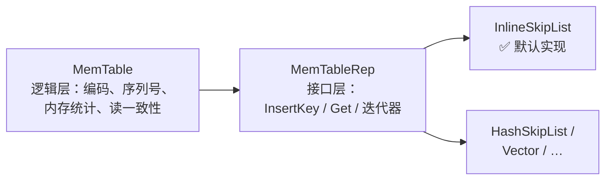

# 📘 SkipList（上）：地图与 InternalKey 编码（The Map & InternalKey Encoding）

> RocksDB 源码精读 · 跳表篇（上） | 源码版本 [`e6a2ee0`](https://github.com/facebook/rocksdb/tree/e6a2ee0bd211489e64a45a6a0f6ce1dc67e195d7) | 本篇涵盖：写入路径全局图、跳表结构原理、Put 调用链源码解析、三层可插拔设计、WriteBatch 格式、Entry 编码、InternalKey 排序规则、读路径可见性

---

## 🧠 核心概念总览

- [*知识点1: LSM 写入路径——跳表的位置*](#id1)
- [*知识点2: 跳表(SkipList)结构原理*](#id2)
- [*知识点3: Put 调用链逐跳源码解析*](#id3)
- [*知识点4: 三层可插拔设计*](#id4)
- [*知识点5: 读路径速览*](#id5)
- [*知识点6: 写批量(WriteBatch)的物理格式*](#id6)
- [*知识点7: Entry 编码与 varint32*](#id7)
- [*知识点8: PackSequenceAndType 位布局*](#id8)
- [*知识点9: InternalKeyComparator 排序规则*](#id9)
- [*知识点10: LookupKey 与 MemTable::Get 的可见性过滤*](#id10)

---

<a id="id1"></a>
## ✅ 知识点 1: LSM 写入路径——跳表的位置

**跳表不直接面对用户写入，它是内存表(MemTable)的默认容器。**

一次写入 `Put("name", "kopi")` 的生命周期：



- **预写日志(Write-Ahead Log, WAL)**：先落盘，防崩溃丢数据
- **内存表(MemTable)**：写入的内存落脚点，默认容器就是跳表
- **SST 文件(Sorted String Table)**：MemTable 写满后冻结刷盘的产物

> 💡 **理解技巧**：跳表只负责"在内存里有序地放 key"。持久化是 WAL 和 SST 的事，不是跳表的事。

<a id="id2"></a>
## ✅ 知识点 2: 跳表(SkipList)结构原理

**跳表 = 多层有序链表：底层全量、上层稀疏索引，查找类似二分。**

```
Level 2:  HEAD ───────────────────────────► 17 ────────────────────────► NULL
                                            │
Level 1:  HEAD ──────────► 9 ────────────► 17 ──────────► 25 ──────────► NULL
                                            │
Level 0:  HEAD ──► 3 ──►  9 ──► 12 ──► 17 ──► 19 ──► 25 ───────────────► NULL

查找 19 的路径：HEAD(L2) → 17(L2) → 下降 → 17(L1) → 下降 → 17(L0) → 19 ✔
```

**核心规则：**

- 第 0 层包含**所有**节点，越往上越稀疏
- 每个节点以概率 $p$ 向上"晋级"一层，层数呈指数衰减分布
- 查找：从最高层向右走，走不通就下降一层 → 期望复杂度 $O(\log n)$
- 插入：先按查找路径定位，再随机决定新节点层数，逐层接指针

**RocksDB 的具体参数**（源码证据 [inlineskiplist.h:74-76](https://github.com/facebook/rocksdb/blob/e6a2ee0bd211489e64a45a6a0f6ce1dc67e195d7/memtable/inlineskiplist.h#L74-L76)）：

```cpp
explicit InlineSkipList(Comparator cmp, Allocator* allocator,
                        int32_t max_height = 12,
                        int32_t branching_factor = 4);
```

- 最高 **12 层**；每晋级一层概率 **1/4**（`branching_factor = 4`，实现见 `RandomHeight()` [inlineskiplist.h:559-570](https://github.com/facebook/rocksdb/blob/e6a2ee0bd211489e64a45a6a0f6ce1dc67e195d7/memtable/inlineskiplist.h#L559-L570)）

> 📋 **术语提醒**：`分支因子(branching factor)` = 相邻两层之间的稀疏比例。$p = 1/4$ 即平均每 4 个节点才有 1 个晋级。
> ⚠️ **关键区分**：晋级概率越小，索引越稀疏、单节点内存越省，但查找步数略增——空间与时间的权衡。

<a id="id3"></a>
## ✅ 知识点 3: Put 调用链逐跳源码解析

**从 `DBImpl::Put` 到跳表插入共 5 跳，每一跳职责单一。**



| 跳 | 位置 | 干了什么 |
|---|------|---------|
| 1 | `DBImpl::Put` → `WriteImpl`（[db_impl_write.cc:87](https://github.com/facebook/rocksdb/blob/e6a2ee0bd211489e64a45a6a0f6ce1dc67e195d7/db/db_impl/db_impl_write.cc#L87) / [:867](https://github.com/facebook/rocksdb/blob/e6a2ee0bd211489e64a45a6a0f6ce1dc67e195d7/db/db_impl/db_impl_write.cc#L867)） | 把 Put 打包进**写批量(WriteBatch)**，统一走写入流程 |
| 2 | `MemTableInserter::PutCFImpl`（[write_batch.cc:2285](https://github.com/facebook/rocksdb/blob/e6a2ee0bd211489e64a45a6a0f6ce1dc67e195d7/db/write_batch.cc#L2285)） | 逐条 replay batch，取出当前**列族(Column Family)**的 MemTable |
| 3 | `mem->Add(...)`（[write_batch.cc:2322](https://github.com/facebook/rocksdb/blob/e6a2ee0bd211489e64a45a6a0f6ce1dc67e195d7/db/write_batch.cc#L2322)） | 把 key/value **连同序列号一起**递给 MemTable |
| 4 | `MemTable::Add`（[memtable.cc:1116](https://github.com/facebook/rocksdb/blob/e6a2ee0bd211489e64a45a6a0f6ce1dc67e195d7/db/memtable.cc#L1116)） | **编码**：(key, seq, type, value) 打包成连续字节 |
| 5 | `SkipListRep::InsertKey` → `InlineSkipList::Insert`（[skiplistrep.cc:46](https://github.com/facebook/rocksdb/blob/e6a2ee0bd211489e64a45a6a0f6ce1dc67e195d7/memtable/skiplistrep.cc#L46) → [inlineskiplist.h:61](https://github.com/facebook/rocksdb/blob/e6a2ee0bd211489e64a45a6a0f6ce1dc67e195d7/memtable/inlineskiplist.h#L61)） | 最终插入跳表 |

**逐段看真实代码：**

**第 3 跳：递交接力棒**（[write_batch.cc:2320-2324](https://github.com/facebook/rocksdb/blob/e6a2ee0bd211489e64a45a6a0f6ce1dc67e195d7/db/write_batch.cc#L2320-L2324)）：

```cpp
if (!moptions->inplace_update_support) {
  ret_status =
      mem->Add(sequence_, value_type, key, value, kv_prot_info,
               concurrent_memtable_writes_, ...);
}
```

- `sequence_`：全局递增的**序列号(Sequence Number)**，MVCC 版本号的来源（知识点 8-9 详讲）
- `value_type`：这条记录是"值"还是**删除标记(tombstone)**——**LSM 的删除是插墓碑，不是真删**
- `concurrent_memtable_writes_`：是否允许并发写 MemTable 的开关（跳表篇（下）详讲）

**第 4 跳：编码成字节串**（格式注释 [memtable.cc:1122-1127](https://github.com/facebook/rocksdb/blob/e6a2ee0bd211489e64a45a6a0f6ce1dc67e195d7/db/memtable.cc#L1122-L1127)，编码实现 [:1142-1152](https://github.com/facebook/rocksdb/blob/e6a2ee0bd211489e64a45a6a0f6ce1dc67e195d7/db/memtable.cc#L1142-L1152)）：

```cpp
// Format of an entry is concatenation of:
//  key_size     : varint32 of internal_key.size()
//  key bytes    : char[internal_key.size()]
//  value_size   : varint32 of value.size()
//  value bytes  : char[value.size()]
char* p = EncodeVarint32(buf, internal_key_size);
memcpy(p, key.data(), key_size);
...
uint64_t packed = PackSequenceAndType(s, type);
EncodeFixed64(p, packed);
```

- 跳表里存的不是 `(key, value)` 对象，而是**一段连续字节**
- `PackSequenceAndType` 把序列号和类型打包进 8 字节——**同一 user key 的多版本靠它区分**（知识点 8）

**第 5 跳：进跳表**（[skiplistrep.cc:46-48](https://github.com/facebook/rocksdb/blob/e6a2ee0bd211489e64a45a6a0f6ce1dc67e195d7/memtable/skiplistrep.cc#L46-L48)）：

```cpp
bool InsertKey(KeyHandle handle) override {
  return skip_list_.Insert(static_cast<char*>(handle));
}
```

- `KeyHandle` 本质就是指向那段字节的裸指针 `char*`（内存由 **Arena 分配器**统一分配，跳表篇（下）讲）
- `static_cast` 零开销：设计契约是"调用方保证传进来的就是跳表分配的字节"

> ⚠️ **关键区分**：跳表存的 key **不是**原始用户 key，而是第 4 跳编码后的字节串（含 seq + type）。

<a id="id4"></a>
## ✅ 知识点 4: 三层可插拔设计

**MemTable 管逻辑，MemTableRep 定接口，InlineSkipList 干苦力。**



**各层职责：**

- **MemTable（逻辑层）**：编码、序列号、内存统计、读一致性
- **MemTableRep（接口层）**：`InsertKey` / `Get` / 迭代器的纯抽象
- **InlineSkipList（实现层）**：真正的跳表；备选还有 HashSkipList、Vector 等

**默认配置证据**（[advanced_options.h:754-755](https://github.com/facebook/rocksdb/blob/e6a2ee0bd211489e64a45a6a0f6ce1dc67e195d7/include/rocksdb/advanced_options.h#L754-L755)）：

```cpp
std::shared_ptr<MemTableRepFactory> memtable_factory =
    std::shared_ptr<SkipListFactory>(new SkipListFactory);
```

> 💡 **理解技巧**：这就是**策略模式(Strategy Pattern)**——换容器不用改 MemTable 一行代码。

<a id="id5"></a>
## ✅ 知识点 5: 读路径速览

**读 = 写入路径倒着走，外加一层"版本可见性"过滤（知识点 10 展开）。**

- `DBImpl::Get` → … → `MemTable::Get`（[memtable.cc:1568](https://github.com/facebook/rocksdb/blob/e6a2ee0bd211489e64a45a6a0f6ce1dc67e195d7/db/memtable.cc#L1568)）
- 查找用的是编码后的 **LookupKey**，比较器按 (user key 升序, seq 降序) 排序（知识点 9）
- MemTable 查不到 → immutable MemTable → 再查 SST

<a id="id6"></a>
## ✅ 知识点 6: 写批量(WriteBatch)的物理格式

**WriteBatch 不是逻辑概念，是一段有严格二进制格式的字节串：12 字节头 + 逐条记录。**

`DBImpl::Put` 并不直接写 MemTable——它先把操作打包成 WriteBatch。源码里的格式注释（[write_batch.cc:10-37](https://github.com/facebook/rocksdb/blob/e6a2ee0bd211489e64a45a6a0f6ce1dc67e195d7/db/write_batch.cc#L10-L37)）：

```
WriteBatch::rep_ :=
    sequence: fixed64     ← 这批写入的起始序列号
    count:    fixed32     ← 批里有几条记录
    data:     record[count]
record := kTypeValue varstring varstring    ← Put: key + value
        | kTypeDeletion varstring           ← Delete: 只有 key
        | kTypeMerge  varstring varstring   ← Merge 操作
        | ...（还有列族变体、事务 XID 等十余种）
varstring := len: varint32 + data: uint8[len]
```

- 头部长度是常量 `kHeader = 12`（[write_batch_internal.h:82](https://github.com/facebook/rocksdb/blob/e6a2ee0bd211489e64a45a6a0f6ce1dc67e195d7/db/write_batch_internal.h#L82)）：8 字节 sequence + 4 字节 count
- **batch 存在的意义**：① 原子性——一批操作要么全写要么全不写；② 摊薄成本——一批只追加一次 WAL、统一分配序列号；③ 崩溃恢复时整批 replay

> 💡 **理解技巧**：把 WriteBatch 理解成"最小写入事务单元"——WAL 里存的是它，MemTable 插入器 replay 的也是它。

<a id="id7"></a>
## ✅ 知识点 7: Entry 编码与 varint32

**跳表里每条记录是自描述的字节串：长度前缀 + key + 8 字节版本标签 + 长度前缀 + value。**

回顾知识点 3 第 4 跳的编码格式（[memtable.cc:1122-1127](https://github.com/facebook/rocksdb/blob/e6a2ee0bd211489e64a45a6a0f6ce1dc67e195d7/db/memtable.cc#L1122-L1127)）：

```
| varint32 key_size | key bytes | 8B packed(seq+type) | varint32 val_size | value bytes | [checksum] |
```

**为什么长度前缀用 varint32 而不是 fixed32？**

- varint32：每字节 7 位存数据、最高位做"还有后续字节"标记 → 长度 ≤127 时只占 **1 字节**
- fixed32 恒占 4 字节；MemTable 里 key/value 长度通常很短，每条省 3 字节，百万条就是 MB 级
- 同一套 varint 编码也用在 LevelDB / Protocol Buffers 里

> 📋 **术语提醒**：`varint(可变长整数)`——小数值少占字节，以 CPU 换空间，是存储系统的常规武器。

<a id="id8"></a>
## ✅ 知识点 8: PackSequenceAndType 位布局

**序列号和记录类型被压进 8 字节：高 56 位是序列号，低 8 位是类型。**

[dbformat.h:181-186](https://github.com/facebook/rocksdb/blob/e6a2ee0bd211489e64a45a6a0f6ce1dc67e195d7/db/dbformat.h#L181-L186)：

```cpp
inline uint64_t PackSequenceAndType(uint64_t seq, ValueType t) {
  assert(seq <= kMaxSequenceNumber);
  assert(IsExtendedValueType(t) || t == kTypeMaxValid);
  return (seq << 8) | t;
}
```

- 解包对称（[dbformat.h:190-194](https://github.com/facebook/rocksdb/blob/e6a2ee0bd211489e64a45a6a0f6ce1dc67e195d7/db/dbformat.h#L190-L194)）：`seq = packed >> 8`、`type = packed & 0xff`
- **位布局决定排序**：packed 值大 ⇔ seq 大（type 只在 seq 相同时起决胜作用）——下个知识点的排序规则建立在这上面
- `ValueType` 常见值：`kTypeValue`（正常值）、`kTypeDeletion`（点删除墓碑）、`kTypeMerge`（合并操作）

> ⚠️ **关键区分**：这 8 字节**跟在 user key 后面**，构成**内部键(InternalKey)**的尾部——跳表排序看的是整个 InternalKey，不是裸 user key。

<a id="id9"></a>
## ✅ 知识点 9: InternalKeyComparator 排序规则

**排序三关键字：user key 升序 → seq 降序 → type 降序。seq 降序是让"查找恰好落在可见版本上"的关键。**

源码注释原文（[dbformat.cc:201-204](https://github.com/facebook/rocksdb/blob/e6a2ee0bd211489e64a45a6a0f6ce1dc67e195d7/db/dbformat.cc#L201-L204)）：

```cpp
// Order by:
//    increasing user key (according to user-supplied comparator)
//    decreasing sequence number
//    decreasing type (though sequence# should be enough to disambiguate)
```

**多版本在跳表里的物理布局**（以 user key `"name"` 写过三次为例）：

```
跳表中的排列（comparator 序）：
… → [name|seq=7] → [name|seq=5] → [name|seq=3] → [下一个 user key] → …
         ▲ 最新版本永远排在同 key 的最前面

查找 name @ 快照 seq=6：
  LookupKey = (name, 6, kValueTypeForSeek)
  按排序规则，它"假想"的位置卡在 seq=7 和 seq=5 之间
  Seek → 第一个 ≥ LookupKey 的条目 = [name|seq=5] ✔ 恰好是可见的最新版本
```

> 💡 **理解技巧**：seq 降序的精妙之处——**一次 Seek 直接命中可见版本**，不用先找到最新再往回退。
> 🔄 **知识关联**：`kValueTypeForSeek = kTypeValuePreferredSeqno`（[dbformat.cc:28](https://github.com/facebook/rocksdb/blob/e6a2ee0bd211489e64a45a6a0f6ce1dc67e195d7/db/dbformat.cc#L28)），与 preferred seqno 读优化有关——细节列入待验证点。

<a id="id10"></a>
## ✅ 知识点 10: LookupKey 与 MemTable::Get 的可见性过滤

**查找时临时拼一个 LookupKey 当"探针"；Get 前置 Bloom 过滤，可见性在逐条回调里判。**

**LookupKey 的布局**（[lookup_key.h:47-57](https://github.com/facebook/rocksdb/blob/e6a2ee0bd211489e64a45a6a0f6ce1dc67e195d7/db/lookup_key.h#L47-L57)）：

```
| varint32 klength | userkey bytes | 8B tag = Pack(seq, kValueTypeForSeek) |
   start_ ↑           kstart_ ↑                                   end_ ↑
```

- 构造实现：[dbformat.cc:245-266](https://github.com/facebook/rocksdb/blob/e6a2ee0bd211489e64a45a6a0f6ce1dc67e195d7/db/dbformat.cc#L245-L266)
- **工程细节**：`char space_[200]` 栈上缓冲区——key 短时零堆分配（同一段还有官方幽默注释 "We don't support user keys of more than 2GB :)"）

**`MemTable::Get` 的流程**（[memtable.cc:1568-1647](https://github.com/facebook/rocksdb/blob/e6a2ee0bd211489e64a45a6a0f6ce1dc67e195d7/db/memtable.cc#L1568-L1647)）：

1. `IsEmpty()` 快速返回
2. **范围删除检查**：`MaxCoveringTombstoneSeqnum`（range tombstone 走独立结构，不占点查询路径）
3. **Bloom 过滤**：`bloom_filter_` 存在时先问一遍——miss 直接判不存在，连跳表都不用进
4. `GetFromTable`（[:1649](https://github.com/facebook/rocksdb/blob/e6a2ee0bd211489e64a45a6a0f6ce1dc67e195d7/db/memtable.cc#L1649)）→ Seek 命中后逐版本回调 `SaveValue`：判可见性（seq ≤ 快照）、判类型（值 / 墓碑 / merge）
5. 读到 `kTypeDeletion` = 该 key 已删除（**墓碑短路**）；读到 merge 操作则标记 `MergeInProgress` 留给上层合并

> ⚠️ **关键区分**：MemTable 也有自己的 Bloom Filter——不是 SST 专利，省的是进跳表 Seek 的 CPU。
> 📋 **术语提醒**：`tombstone(墓碑)` = 删除操作写入的特殊记录，读时判死、Compaction 时才真正清理。

---

## 🔑 核心要点总结

1. 跳表是 MemTable 的**默认容器**，位于写入路径 WAL 之后、SST 之前
2. Put 五跳：`DBImpl::Put` → `WriteImpl/WriteBatch` → `MemTableInserter::PutCFImpl` → `MemTable::Add`（编码）→ `SkipListRep::InsertKey` → `InlineSkipList::Insert`
3. WriteBatch 物理格式 = `fixed64 sequence | fixed32 count | record[count]`，头 12 字节；batch 提供原子性并摊薄 WAL 成本
4. 跳表存的是**编码后的字节串**：`varint(key_size) | key | packed(seq+type) 8B | varint(value_size) | value`
5. `PackSequenceAndType`：`(seq << 8) | type`——高 56 位序列号、低 8 位类型
6. InternalKey 排序：**user key 升序 → seq 降序 → type 降序**；seq 降序让 Seek 一步命中可见版本
7. LookupKey 带 `space_[200]` 栈上缓冲区，短 key 零堆分配
8. `MemTable::Get`：范围删除检查 → Bloom 过滤 → Seek → `SaveValue` 逐版本判可见性与墓碑

## 📌 面试速记版

- **写入路径**：Put → WAL → MemTable(跳表) → 冻结 → SST
- **Entry 编码**：`varint(key_size) | key | packed(seq+type) 8B | varint(value_size) | value`
- **InternalKey 排序**：user key 升 / seq 降 / type 降 → 一次 Seek 命中可见版本
- **WriteBatch**：12 字节头（seq + count）+ 逐条 record；原子性 + 摊薄 WAL
- **删除即墓碑**：`kTypeDeletion`，读时短路，Compaction 才真删
- **易混点**：跳表里的 "key" ≠ 用户 key，是含序列号的 InternalKey 编码；MemTable 也有 Bloom Filter

**记忆口诀**：先落日志再进表，编码打包版本号；key 升序版本倒，Seek 一步命中到。

## ✅ 自测 Checkpoint

1. 一个 Put 从入口到跳表依次经过哪 5 跳？各自一句话职责。
2. WriteBatch 头部的 12 字节装的是什么？batch 解决了哪三个问题？
3. varint32 相比 fixed32 省在哪？什么场景最划算？
4. `PackSequenceAndType` 的位布局是什么？为什么排序时 type 只是决胜项？
5. InternalKey 排序的三关键字顺序？为什么 seq 必须降序？
6. 跳表里存的 key 和用户的原始 key 有什么区别？
7. `MemTable::Get` 从进入到返回经过哪几步？Bloom Filter 在这一层省的是什么？

## 🔍 待验证点

【到源码核实】格式：结论 → `文件:行号` → ✅/❌ → 若有误记录正确结论

1. `kValueTypeForSeek = kTypeValuePreferredSeqno` 的语义：它与 preferred seqno 读优化的关系 → [dbformat.cc:28](https://github.com/facebook/rocksdb/blob/e6a2ee0bd211489e64a45a6a0f6ce1dc67e195d7/db/dbformat.cc#L28) 起，搜索 `kTypeValuePreferredSeqno` 的使用处
2. `EncodeVarint32` 的具体实现位置（`util/coding.cc` 还是 `util/coding_lean.cc`）与编码逻辑 → 本地克隆 `grep -rn "EncodeVarint32" util/`

⏸ **停止点**。下一篇：跳表篇（下）——Node 内存布局与无锁并发核心。
