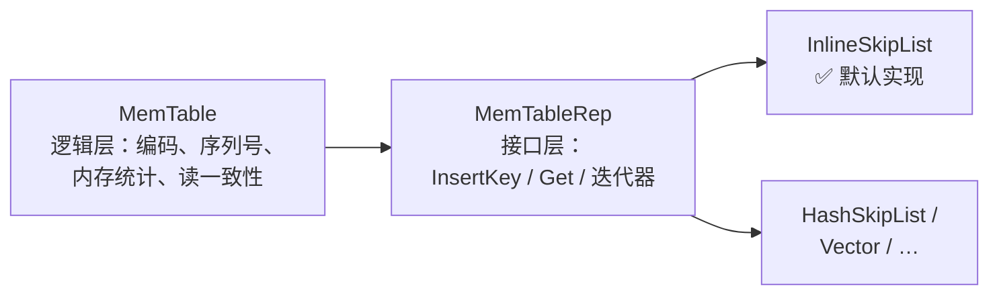
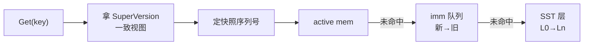

# 📘 SkipList（上）：工作流程与 InternalKey 编码（Workflow & InternalKey Encoding）

> RocksDB 源码精读 · 跳表篇（上） | 源码版本 [`e6a2ee0`](https://github.com/facebook/rocksdb/tree/e6a2ee0bd211489e64a45a6a0f6ce1dc67e195d7) | 本篇涵盖：Put/Get 完整工作流、跳表结构原理、三层可插拔设计、WriteBatch 格式、Entry 编码、InternalKey 排序规则、LookupKey

---

## 🧠 核心概念总览

- [*知识点1: Put 完整工作流（组提交）*](#id1)
- [*知识点2: 跳表(SkipList)结构原理*](#id2)
- [*知识点3: 三层可插拔设计*](#id3)
- [*知识点4: 写批量(WriteBatch)的物理格式*](#id4)
- [*知识点5: Entry 编码与 varint32*](#id5)
- [*知识点6: PackSequenceAndType 位布局*](#id6)
- [*知识点7: InternalKeyComparator 排序规则*](#id7)
- [*知识点8: LookupKey 结构与栈上缓冲优化*](#id8)
- [*知识点9: Get 完整工作流（SuperVersion 三级查找）*](#id9)
- [*知识点10: MemTable::Get 内部细节*](#id10)

---

<a id="id1"></a>
## ✅ 知识点 1: Put 完整工作流（组提交）

**Put 不是一次函数调用...**

**一次 `Put` 的完整旅程（编号即顺序）**：

1. **打包**：`DBImpl::Put` 把操作装进 `WriteBatch`，进入 `WriteImpl`（[db_impl_write.cc:867](https://github.com/facebook/rocksdb/blob/e6a2ee0bd211489e64a45a6a0f6ce1dc67e195d7/db/db_impl/db_impl_write.cc#L867)）
    - 你调用 `db->Put(key, value)` 时，RocksDB 不会立刻写磁盘
    - 它先把你的 `key-value` 包进一个 `WriteBatch`（写批次）对象里
    - 然后进入内部的 `WriteImpl` 函数，这是写入路径的真正入口
2. **组队（组提交 Group Commit）**：`write_thread_.JoinBatchGroup(&w)`（[:1099](https://github.com/facebook/rocksdb/blob/e6a2ee0bd211489e64a45a6a0f6ce1dc67e195d7/db/db_impl/db_impl_write.cc#L1099)）——并发写线程在此汇合：**先到的当 leader，其余当 follower**
    - 多个线程同时调用 Put 时，它们都会跑到这里
    - 第一个到达的线程当 leader（队长），后面的线程当 follower（队员）
    - Follower 把它们的 `WriteBatch` 挂到 leader 的后面，然后阻塞等待
    > 类比：地铁闸机，第一个人刷卡后，后面几个人把票都给他，他统一刷卡，大家依次通过
3. **leader 预处理**：`PreprocessWrite`（[:1179](https://github.com/facebook/rocksdb/blob/e6a2ee0bd211489e64a45a6a0f6ce1dc67e195d7/db/db_impl/db_impl_write.cc#L1179)）——检查 MemTable 是否写满；若满则 `SwitchMemtable`（[:388](https://github.com/facebook/rocksdb/blob/e6a2ee0bd211489e64a45a6a0f6ce1dc67e195d7/db/db_impl/db_impl_write.cc#L388)）：当前 active 被 `MarkImmutable()` 打成只读、挂进 `imm_` 队列，另建一个新的 active
    - Leader 在真正写之前，先检查当前的 active MemTable（正在写的内存跳表）是否达到阈值
    - 如果满了：
        - 把当前的 active MemTable 标记为只读（`MarkImmutable()`）
        - 把它挂进 `imm_` 队列（`immutable memtable list`），等待后台线程 flush 到磁盘
        - 新建一个空的 active MemTable，供后续写入使用
4. **leader 写 WAL**：整组的 batch 合并后一次性 `WriteToWAL`（[:2262](https://github.com/facebook/rocksdb/blob/e6a2ee0bd211489e64a45a6a0f6ce1dc67e195d7/db/db_impl/db_impl_write.cc#L2262)）——**序列号在写 WAL 时统一分配**（[:1375](https://github.com/facebook/rocksdb/blob/e6a2ee0bd211489e64a45a6a0f6ce1dc67e195d7/db/db_impl/db_impl_write.cc#L1375) 注释）。**WAL 先落盘、MemTable 后更新，崩溃恢复依赖这个顺序**
    - Leader 把自己和所有 follower 的 `WriteBatch` 合并成一个大 batch
    - 然后调用 `WriteToWAL`，一次性把合并后的数据写到 WAL（预写日志）磁盘文件
    - 关键细节：
        - 序列号（sequence number）在此时统一分配，保证顺序
        - WAL 先落盘，MemTable 后更新——如果进程在 WAL 写完后、MemTable 更新前崩溃，恢复时可以通过重放 WAL 找回数据
5. **插 MemTable**：WAL 写完后，整组人（leader + followers）的 batch 数据需要插入到内存的 active MemTable（跳表）中，这里分了两种策略：
   - **非并发模式**：**Leader 一个人干**，leader 统一 replay 整组 batch
   - **并发模式（默认）**：**大家各自干**，leader 写完 WAL 放行，**follower 各自**调 `WriteBatchInternal::InsertInto`（[:1112-1117](https://github.com/facebook/rocksdb/blob/e6a2ee0bd211489e64a45a6a0f6ce1dc67e195d7/db/db_impl/db_impl_write.cc#L1112-L1117)），以 `concurrent_memtable_writes=true` **并发**插跳表——**这就是 InlineSkipList 必须做成无锁的根因**（跳表篇（下）的核心动机）
6. **发布**：等全组人都把数据插进 MemTable 后 `versions_->SetLastSequence(last_sequence)`（[:1137](https://github.com/facebook/rocksdb/blob/e6a2ee0bd211489e64a45a6a0f6ce1dc67e195d7/db/db_impl/db_impl_write.cc#L1137)）——新序列号对读者可见，写入返回
    - RocksDB 用序列号（sequence number）实现 MVCC（多版本并发控制）。每个 key-value 在 `MemTable` 里都有一个 seq
    - 读线程读数据时，只读 `seq ≤ last_sequence` 的数据
    - 在 `SetLastSequence` 之前，虽然数据已经在 `MemTable` 里了，但读线程"看不到"——因为它们的 `seq` 大于当前的 `last_sequence`
    - 调用后，`last_sequence` 被推进到这组写入的最大 `seq`，**整组写入原子性对外可见**


**所以在全过程中起到关键作用的`memtable`到底是什么？**
- MemTable 在 RocksDB 里有两种身份：


    - **active**（`cfd->mem()`，[column_family.h:381](https://github.com/facebook/rocksdb/blob/e6a2ee0bd211489e64a45a6a0f6ce1dc67e195d7/db/column_family.h#L381)）：可读可写，**唯一**
    - **immutable 队列**（`cfd->imm()`，[:380](https://github.com/facebook/rocksdb/blob/e6a2ee0bd211489e64a45a6a0f6ce1dc67e195d7/db/column_family.h#L380)，类型 `MemTableList`）：**只读**，按新→旧排列，排队等后台 flush 成 SST

**"插入 MemTable"最终落到的就是跳表本身**：active MemTable 的容器正是 `InlineSkipList`：

- **插入链路的最后一跳**（第 5 步的代码特写，[skiplistrep.cc:46-48](https://github.com/facebook/rocksdb/blob/e6a2ee0bd211489e64a45a6a0f6ce1dc67e195d7/memtable/skiplistrep.cc#L46-L48)）：

    ```cpp
    bool InsertKey(KeyHandle handle) override {
    return skip_list_.Insert(static_cast<char*>(handle));
    }
    ```

    - `KeyHandle` 本质就是指向编码字节的裸指针 `char*`（内存由 **Arena 分配器**统一分配，跳表篇（下）讲）
    - `static_cast` 零开销：设计契约是"调用方保证传进来的就是跳表分配的字节"

> 💡 **理解技巧**：组提交把 N 个线程的 WAL 写合并成 1 次，摊薄昂贵的磁盘 IO；插跳表走无锁，把 CPU 并行度拉满——**串行化昂贵的，并行化便宜的**。
> ⚠️ **关键区分**：WAL 落盘 ≠ 数据可读。序列号经 `SetLastSequence` 发布后，这版数据才对读者可见。


---

<a id="id2"></a>
## ✅ 知识点 2: 跳表(SkipList)结构原理

**跳表 = 多层有序链表：底层全量、上层稀疏索引，查找类似二分。**

```
Level 2:  HEAD ───────────────────────────► 17 ────────────────────────► NULL
                                            │
Level 1:  HEAD ──────────► 9 ────────────►  17 ──────────► 25 ──────────► NULL
                                            │
Level 0:  HEAD  ──►  3 ──► 9 ──►  12  ──►   17 ──►  19 ──► 25 ───────────────► NULL

查找 19 的路径：HEAD(L2) → 17(L2) → 下降 → 17(L1) → 下降 → 17(L0) → 19 ✔
插入 22 的路径：HEAD(L2) → 17(L2) → 下降 → 17(L1) → 下降 → 17(L0) → 19 前驱找到 → 插入 22 
```

**核心规则：**

- 第 0 层包含**所有**节点，越往上越稀疏
- 每个节点以概率 $p$ 向上"晋级"一层，层数呈指数衰减分布
- **查找**：从最高层向右走，走不通就下降一层 → 期望复杂度 $O(\log n)$
    1. **从最顶层开始**：从跳表的最高层（最稀疏的索引层）的头部节点出发。
    2. **向右大步跳跃**：在当前层向右遍历，如果下一个节点的值 **小于** 目标值，就继续向右跳。
    3. **太大就往下掉**：如果下一个节点的值 **大于或等于** 目标值，或者右边没节点了，就下降到下一层。
    4. **重复直到底层**：在下一层继续执行"向右跳→太大就下降"的过程，直到到达最底层（原始数据层）。
    5. **底层精确定位**：在最底层继续向右比较，找到目标值或确认不存在。
- **插入**：先按查找路径定位，再随机决定新节点层数，逐层接指针
    1. **先找到位置**：像查找一样从顶层往下走，记录每层最后经过的节点（这些就是新节点的前驱）。
    2. **抛硬币定层高**：随机决定新节点有几层（比如抛硬币，正面就加一层，直到反面为止）。
    3. **创建节点**：按决定的层数创建新节点，存好要插入的值。
    4. **各层插入链表**：从最底层到最高层，像普通链表一样把新节点"缝"进前驱和后继之间。
    5. **更新表头高度**：如果新节点层数超过了当前最高层，把头节点也增高到这一层。

**RocksDB 的具体参数**（源码证据 [inlineskiplist.h:74-76](https://github.com/facebook/rocksdb/blob/e6a2ee0bd211489e64a45a6a0f6ce1dc67e195d7/memtable/inlineskiplist.h#L74-L76)）：

```cpp
explicit InlineSkipList(Comparator cmp, Allocator* allocator,
                        int32_t max_height = 12,
                        int32_t branching_factor = 4);
```

- 最高 **12 层**；每晋级一层概率 **1/4**（`branching_factor = 4`，实现见 `RandomHeight()` [inlineskiplist.h:559-570](https://github.com/facebook/rocksdb/blob/e6a2ee0bd211489e64a45a6a0f6ce1dc67e195d7/memtable/inlineskiplist.h#L559-L570)）

> 📋 **术语提醒**：`分支因子(branching factor)` = 相邻两层之间的稀疏比例。$p = 1/4$ 即平均每 4 个节点才有 1 个晋级。
> ⚠️ **关键区分**：晋级概率越小，索引越稀疏、单节点内存越省，但查找步数略增——空间与时间的权衡。


---

<a id="id3"></a>
## ✅ 知识点 3: 三层可插拔设计

它在 RocksDB 里被谁包着、怎么被调用：**MemTable 管逻辑，MemTableRep 定接口，InlineSkipList 干苦力。**



**各层职责：**

- **MemTable（逻辑层）**：编码、序列号、内存统计、读一致性；对外由 `ColumnFamilyData` 持有为 `mem()` / `imm()` 两兄弟（[column_family.h:380-381](https://github.com/facebook/rocksdb/blob/e6a2ee0bd211489e64a45a6a0f6ce1dc67e195d7/db/column_family.h#L380-L381)）
- **MemTableRep（接口层）**：`InsertKey` / `Get` / 迭代器的纯抽象类（`include/rocksdb/memtablerep.h`）
- **InlineSkipList（实现层）**：真正的跳表；备选还有 HashSkipList、Vector 等

**默认配置**（[advanced_options.h:754-755](https://github.com/facebook/rocksdb/blob/e6a2ee0bd211489e64a45a6a0f6ce1dc67e195d7/include/rocksdb/advanced_options.h#L754-L755)）：

1. **策略模式解决"用什么"**：MemTable 只依赖 `MemTableRep` 接口，底层是跳表、哈希跳表还是 Vector 对它完全透明。运行时换配置就能切策略，代码不用改。

2. **工厂模式解决"怎么造"**：创建跳表需要传比较器、分配器等一堆参数，MemTable 不想管这些脏活。工厂把创建逻辑包起来，MemTable 只管调用 `CreateMemTableRep()` 拿成品用。

```cpp
std::shared_ptr<MemTableRepFactory> memtable_factory =
    std::shared_ptr<SkipListFactory>(new SkipListFactory);
```


---

<a id="id4"></a>
## ✅ 知识点 4: 写批量(WriteBatch)的物理格式
**MemTable 拿到数据后的第一件事是编码，而编码的源头是写批量——WriteBatch 长什么样**

- WriteBatch 是 RocksDB 的**最小写入事务单元**——WAL 存的是它，MemTable 回放的还是它
    
    - **本质是一段二进制字节串**  
        不是逻辑对象，是 `12字节头 + N条记录` 的紧凑二进制格式，直接往 WAL 里写

    - **头部 12 字节：sequence + count**  
        前 8 字节存这批写入的起始序列号，后 4 字节存有几条记录，后面紧跟具体数据。

    - **每条记录(record) = 类型标签 + 内容**  
        Put 是 `类型 + key + value`，Delete 是 `类型 + key`，Merge 类似；key/value 前面带长度前缀。

    - **存在的三个意义**  
        **原子性**（一批要么全写要么全不写）、**摊薄成本**（一批只写一次 WAL、统一分配序列号）、**崩溃恢复整批 replay**。


- 源码里的格式注释（[write_batch.cc:10-37](https://github.com/facebook/rocksdb/blob/e6a2ee0bd211489e64a45a6a0f6ce1dc67e195d7/db/write_batch.cc#L10-L37)）：

    ```
    WriteBatch::rep_ :=
        sequence: fixed64     ← 这批写入的起始序列号
        count:    fixed32     ← 批里有几条记录
        data:     record[count]
    record := kTypeValue varstring varstring    ← Put: key + value
            | kTypeDeletion varstring           ← Delete: 只有 key
            | kTypeMerge  varstring varstring   ← Merge 操作
            | ...（还有列族变体、事务 XID 等十余种）
    varstring := len: varint32 + data: uint8[len]
    ```

    - **头部长度是常量 `kHeader = 12`**（[write_batch_internal.h:82](https://github.com/facebook/rocksdb/blob/e6a2ee0bd211489e64a45a6a0f6ce1dc67e195d7/db/write_batch_internal.h#L82)）：8 字节 sequence + 4 字节 count
    - **WriteBatch 是"集装箱"**：整体是一段二进制字节串，包含 12 字节头部 + 一堆 record
        - RocksDB 允许你先 batch.Put(k1, v1)、batch.Delete(k2)，再 db.Write(batch)，这样一批里就有多个 record
        - 多个线程同时写时，RocksDB 会把它们攒成一个 WriteBatch 一起刷 WAL，减少磁盘 IO 次数
    - **record 是"集装箱里的货"**：每条 record 是一次具体操作（Put / Delete / Merge），是 WriteBatch 的组成部分

    - **count 告诉你有几件货**：WriteBatch 头部里的 `count` 字段，说明后面紧跟了多少条 record

    - **解析时逐个拆箱**：先读 12 字节头拿到 `count`，然后循环 `count` 次，每次按类型解析一条 record

> **一句话关系**：**WriteBatch 装 record，record 是 WriteBatch 的最小操作单元**


---

<a id="id5"></a>
## ✅ 知识点 5: Entry 编码与 varint32

**batch replay 之后，每条记录进 MemTable 时怎么编码**

- **MemTable 里存的不是原始 key，是一段"打包好的字节串"：长度前缀 + key + 8 字节版本标签 + 长度前缀 + value**
    - **8 字节 `packed` 是"身份证"**: 把序列号（`seq`）和操作类型（`Put/Delete`）打包成 8 字节塞在 `key` 和 `value` 中间，用来区分同 一 `key` 的不同版本

- `MemTable::Add` 的编码（格式注释 [memtable.cc:1122-1127](https://github.com/facebook/rocksdb/blob/e6a2ee0bd211489e64a45a6a0f6ce1dc67e195d7/db/memtable.cc#L1122-L1127)，实现 [:1142-1152](https://github.com/facebook/rocksdb/blob/e6a2ee0bd211489e64a45a6a0f6ce1dc67e195d7/db/memtable.cc#L1142-L1152)）：

    ```cpp
    // Format of an entry is concatenation of:
    //  key_size     : varint32 of internal_key.size()
    //  key bytes    : char[internal_key.size()]
    //  value_size   : varint32 of value.size()
    //  value bytes  : char[value.size()]
    // 把 internal_key_size 这个整数，用 VarInt 的方式写进内存
    char* p = EncodeVarint32(buf, internal_key_size);
    // 把真正的 key 内容复制到刚才那个位置后面
    memcpy(p, key.data(), key_size);
    ...
    // seq + type 打包成 uint64_t 版本信息
    uint64_t packed = PackSequenceAndType(s, type);
    // 将版本信息固定写入 8 bytes
    EncodeFixed64(p, packed);
    ```

    ```
    | varint32 key_size | key bytes | 8B packed(seq+type) | varint32 val_size | value bytes | [checksum] |
    ```

- **为什么用 varint32 存长度？省空间**

    - RocksDB 怎么知道 key/val 有多长，需要一个 `key_size`，`value_size` 告知
    - **VarInt32 用小数值少占字节，绝大多数 key/value 长度很短，百万条记录能省 MB 级内存。**
        - `varint32`： value或key长度 ≤127 时只占 **1 字节**
        - `fixed32` 恒占 **4 字节**
    - 同一套 varint 编码也用在 LevelDB / Protocol Buffers 里
- **`internal key` 又是什么？** 
    - RocksDB 有 `User Key` 比如 `"name"`
    - `Internal Key` =  `User Key ` + ` 8-byte packed`
    - 存储是真正使用的 'key'

> ⚠️ **关键区分**：跳表存的 key **不是**原始用户 key，而是这段编码字节串（含 seq + type）。
> 📋 **术语提醒**：`varint(可变长整数)`——小数值少占字节，以 CPU 换空间，是存储系统的常规武器。

---

<a id="id6"></a>
## ✅ 知识点 6: PackSequenceAndType 位布局

**编码里那 8 字节 `packed` 到底装了什么？**

- **序列号和记录类型被压进 8 字节：高 56 位是序列号，低 8 位是类型**[dbformat.h:181-186](https://github.com/facebook/rocksdb/blob/e6a2ee0bd211489e64a45a6a0f6ce1dc67e195d7/db/dbformat.h#L181-L186)：

    ```cpp
    // 左移 8 位给 type 腾座位，或运算把它塞进去；
    // 拆的时候右移还原 seq，掩码抠出 type
    inline uint64_t PackSequenceAndType(uint64_t seq, ValueType t) {
    assert(seq <= kMaxSequenceNumber);
    assert(IsExtendedValueType(t) || t == kTypeMaxValid);
    return (seq << 8) | t;
    }
    ```

    - 解包对称（[dbformat.h:190-194](https://github.com/facebook/rocksdb/blob/e6a2ee0bd211489e64a45a6a0f6ce1dc67e195d7/db/dbformat.h#L190-L194)）：
        1. `seq = packed >> 8`：整体右移 8 位，扔掉 `type`，还原 `seq`
        2. `type = packed & 0xff`：`0xFF` 是 `11111111`，只保留低 8 位，抠出 `type`
    - **位布局决定排序**：packed 值大 ⇔ seq 大（type 只在 seq 相同时起决胜作用）——知识点 7 的排序规则建立在这上面
    - `ValueType` 常见值：`kTypeValue`（正常值）、`kTypeDeletion`（点删除墓碑）、`kTypeMerge`（合并操作）

> ⚠️ **关键区分**：这 8 字节**跟在 user key 后面**，构成**内部键**(InternalKey)的尾部——跳表排序看的是整个 InternalKey，不是裸 user key

---


<a id="id7"></a>
## ✅ 知识点 7: InternalKeyComparator 排序规则

→ **下一站**：packed 的位布局直接决定了跳表的排序规则——知识点 7

**排序三关键字：user key 升序 → seq 降序 → type 降序。seq 降序是让"查找恰好落在可见版本上"的关键。**

源码注释原文（[dbformat.cc:201-204](https://github.com/facebook/rocksdb/blob/e6a2ee0bd211489e64a45a6a0f6ce1dc67e195d7/db/dbformat.cc#L201-L204)）：

```cpp
// Order by:
//    increasing user key (according to user-supplied comparator)
//    decreasing sequence number
//    decreasing type (though sequence# should be enough to disambiguate)
```

**多版本在跳表里的物理布局**（以 user key `"name"` 写过三次为例）：

```
跳表中的排列（comparator 序）：
… → [name|seq=7] → [name|seq=5] → [name|seq=3] → [下一个 user key] → …
         ▲ 最新版本永远排在同 key 的最前面

查找 name @ 快照 seq=6：
  LookupKey = (name, 6, kValueTypeForSeek)
  按排序规则，它"假想"的位置卡在 seq=7 和 seq=5 之间
  Seek → 第一个 ≥ LookupKey 的条目 = [name|seq=5] ✔ 恰好是可见的最新版本
```

> 💡 **理解技巧**：seq 降序的精妙之处——**一次 Seek 直接命中可见版本**，不用先找到最新再往回退。
> 🔄 **知识关联**：`kValueTypeForSeek = kTypeValuePreferredSeqno`（[dbformat.cc:28](https://github.com/facebook/rocksdb/blob/e6a2ee0bd211489e64a45a6a0f6ce1dc67e195d7/db/dbformat.cc#L28)），与 preferred seqno 读优化有关——细节列入待验证点。

→ **下一站**：排序规则定了，查找时拿什么当"探针"去 Seek？知识点 8。

<a id="id8"></a>
## ✅ 知识点 8: LookupKey 结构与栈上缓冲优化

**查找时临时拼一个 LookupKey 当"探针"；短 key 直接放栈上，零堆分配。**

**布局**（[lookup_key.h:47-57](https://github.com/facebook/rocksdb/blob/e6a2ee0bd211489e64a45a6a0f6ce1dc67e195d7/db/lookup_key.h#L47-L57)）：

```
| varint32 klength | userkey bytes | 8B tag = Pack(seq, kValueTypeForSeek) |
   start_ ↑           kstart_ ↑                                   end_ ↑
```

- 构造实现：[dbformat.cc:245-266](https://github.com/facebook/rocksdb/blob/e6a2ee0bd211489e64a45a6a0f6ce1dc67e195d7/db/dbformat.cc#L245-L266)
- **工程细节**：`char space_[200]` 栈上缓冲区——key 短时零堆分配（同一段还有官方幽默注释 "We don't support user keys of more than 2GB :)"）
- `memtable_key()` 返回从 `start_` 起的整段；`internal_key()` 返回从 `kstart_` 起的后缀——**同一段内存，两个视图**

> 💡 **理解技巧**：栈上小缓冲区（SSO 思想）是高频小对象的标准优化——Get 是热路径，省一次 malloc 就是省一次潜在的缓存未命中。

→ **下一站**：探针有了，一次完整的 Get 走什么路线？知识点 9。

<a id="id9"></a>
## ✅ 知识点 9: Get 完整工作流（SuperVersion 三级查找）

**读的核心思想：先拿一张"一致视图"（SuperVersion），再按 新→旧 三级查找。**

一次 `Get` 的完整旅程（注意：实现由协程宏生成，真身在 [db_impl_sync_and_async.h](https://github.com/facebook/rocksdb/blob/e6a2ee0bd211489e64a45a6a0f6ce1dc67e195d7/db/db_impl/db_impl_sync_and_async.h)）：

1. **取视图**：`GetAndRefSuperVersion(cfd)`（[:126](https://github.com/facebook/rocksdb/blob/e6a2ee0bd211489e64a45a6a0f6ce1dc67e195d7/db/db_impl/db_impl_sync_and_async.h#L126)）——SuperVersion = 当前 active mem + imm 队列 + 当前 Version（SST 集合）的**一致快照**（结构定义 [column_family.h:208-214](https://github.com/facebook/rocksdb/blob/e6a2ee0bd211489e64a45a6a0f6ce1dc67e195d7/db/column_family.h#L208-L214)）
2. **定快照序列号**：有用户快照用快照的；否则 `GetLastPublishedSequence()`（[:141-156](https://github.com/facebook/rocksdb/blob/e6a2ee0bd211489e64a45a6a0f6ce1dc67e195d7/db/db_impl/db_impl_sync_and_async.h#L141-L156)）。源码注释点出一个微妙的并发正确性细节（[:151-155](https://github.com/facebook/rocksdb/blob/e6a2ee0bd211489e64a45a6a0f6ce1dc67e195d7/db/db_impl/db_impl_sync_and_async.h#L151-L155)）：**必须先引用 SuperVersion 再取序列号**——否则两步之间发生 flush，可能把快照本应看到的数据 compact 掉
3. **拼探针**：`LookupKey lkey(key, snapshot, ...)`（[:201](https://github.com/facebook/rocksdb/blob/e6a2ee0bd211489e64a45a6a0f6ce1dc67e195d7/db/db_impl/db_impl_sync_and_async.h#L201)）
4. **三级查找，新→旧**：
   - `sv->mem->Get(...)`——active MemTable（[:233](https://github.com/facebook/rocksdb/blob/e6a2ee0bd211489e64a45a6a0f6ce1dc67e195d7/db/db_impl/db_impl_sync_and_async.h#L233)）
   - 未命中 → `sv->imm->Get(...)`——immutable 队列（[:251](https://github.com/facebook/rocksdb/blob/e6a2ee0bd211489e64a45a6a0f6ce1dc67e195d7/db/db_impl/db_impl_sync_and_async.h#L251)）
   - 再未命中 → `sv->current->Get(...)`——SST 层（[:296](https://github.com/facebook/rocksdb/blob/e6a2ee0bd211489e64a45a6a0f6ce1dc67e195d7/db/db_impl/db_impl_sync_and_async.h#L296)）
5. **每层内部**：`MemTable::Get` 的细节见知识点 10



> 💡 **理解技巧**：SuperVersion 是 MVCC 的"取景框"——读全程不加 DB 级大锁，靠引用计数固定住这一刻的 mem/imm/Version 三件套。
> 🔄 **知识关联**：第 4 步解释了为什么"刚写进的立刻能读到"——active 永远最先查；"刷盘后还能读到旧数据"靠的是 SST 层的版本接力。

→ **下一站**：三级查找里每一级的 `MemTable::Get` 内部又做了什么？知识点 10。

<a id="id10"></a>
## ✅ 知识点 10: MemTable::Get 内部细节

**进跳表之前先问 Bloom；命中之后逐版本判可见性；读到墓碑立即短路。**

`MemTable::Get` 的流程（[memtable.cc:1568-1647](https://github.com/facebook/rocksdb/blob/e6a2ee0bd211489e64a45a6a0f6ce1dc67e195d7/db/memtable.cc#L1568-L1647)）：

1. `IsEmpty()` 快速返回
2. **范围删除检查**：`MaxCoveringTombstoneSeqnum`（range tombstone 走独立结构，不占点查询路径）
3. **Bloom 过滤**：`bloom_filter_` 存在时先问一遍——miss 直接判不存在，连跳表都不用进
4. `GetFromTable`（[:1649](https://github.com/facebook/rocksdb/blob/e6a2ee0bd211489e64a45a6a0f6ce1dc67e195d7/db/memtable.cc#L1649)）→ Seek 命中后逐版本回调 `SaveValue`：判可见性（seq ≤ 快照）、判类型（值 / 墓碑 / merge）
5. 读到 `kTypeDeletion` = 该 key 已删除（**墓碑短路**）；读到 merge 操作则标记 `MergeInProgress` 留给上层合并

> ⚠️ **关键区分**：MemTable 也有自己的 Bloom Filter——不是 SST 专利，省的是进跳表 Seek 的 CPU。
> 📋 **术语提醒**：`tombstone(墓碑)` = 删除操作写入的特殊记录，读时判死、Compaction 时才真正清理。

---

## 🔑 核心要点总结

1. Put 全流程：**组队（JoinBatchGroup）→ leader 预处理（满则冻结切换）→ 合并写 WAL（分配序列号）→ 组员并发插跳表 → SetLastSequence 发布**
2. MemTable 两种身份：active 唯一可读写；immutable 队列只读、新→旧、等 flush
3. 跳表是 MemTable 的默认容器；RocksDB 参数：最高 12 层、晋级概率 1/4
4. 三层分离（MemTable / MemTableRep / InlineSkipList）= 策略模式，容器可插拔
5. WriteBatch 物理格式 = `fixed64 sequence | fixed32 count | record[count]`，头 12 字节；batch 提供原子性并摊薄 WAL 成本
6. Entry 编码：`varint(key_size) | key | packed(seq+type) 8B | varint(value_size) | value`
7. InternalKey 排序：**user key 升序 → seq 降序 → type 降序**；seq 降序让 Seek 一步命中可见版本
8. LookupKey 带 `space_[200]` 栈上缓冲，短 key 零堆分配
9. Get 全流程：**拿 SuperVersion → 定快照 seq → 拼 LookupKey → active → imm → SST** 三级查找
10. `MemTable::Get` 内部：范围删除检查 → Bloom 过滤 → Seek → SaveValue 判可见性 → 墓碑短路

